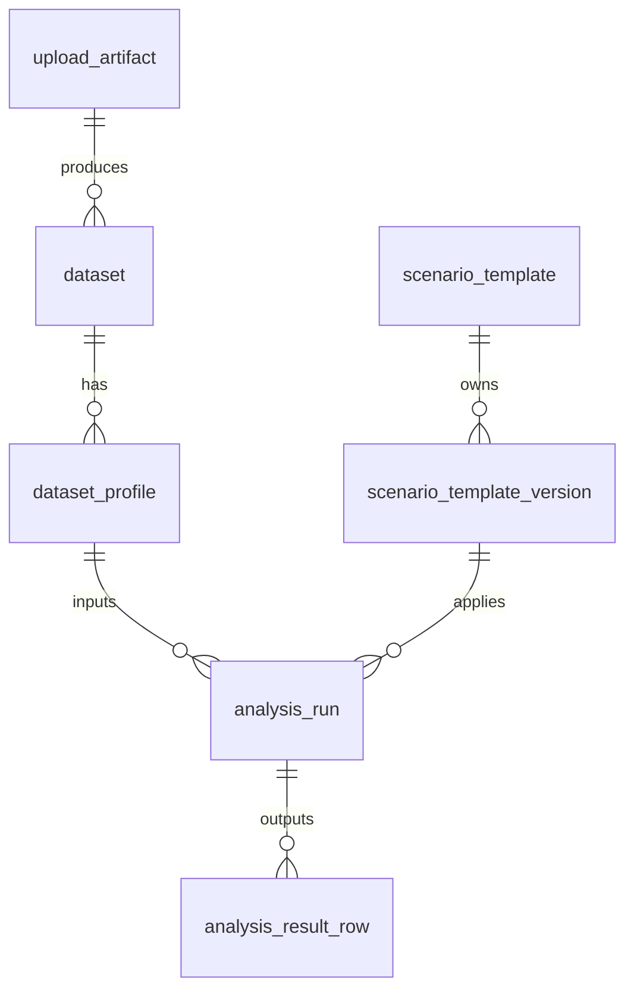

# 开放日数据结构与持久化演进方案

最后整理：2026-04-17

这份文档回答三个问题：

1. 现在开放日模块的数据链路是什么样。
2. 为什么现有结构还不够支撑下一轮功能扩展。
3. 下一轮应该按什么顺序把数据结构和持久化升级掉。

## 先给结论

当前 `modules/open-day` 的分层方向是对的，但持久化语义还停留在“结果缓存 + 简化快照 + 简化模板”的阶段。

如果下一轮要继续做这些能力：

- 方案版本管理
- 历史回放与对比
- 按方案聚合分析
- 数据源复用
- 批量重算
- 导出与审计

那就需要把现在的“一个测算请求对应一坨 JSON”升级成几个稳定实体，并把“缓存”和“审计事件”彻底拆开。

## 当前状态

当前已经存在的结构化对象主要有三类：

- `open_day_scenario_templates`
- `open_day_analysis_snapshots`
- `open_day_upload_artifacts`

其中：

- 方案模板保存的是整个 `scenario_json`
- 测算快照保存的是 `command_json + response_json`
- 上传归档保存的是文件元数据和 Blob/本地文件位置

当前优点：

- 足够快接入
- 本地与 Neon 双模式都能跑
- 回放单次历史已经可用
- 文件归档与测算结果已经能关联

当前问题：

- 快照和缓存耦合，缓存命中时不会产生新的测算事件
- 方案没有稳定主键与版本概念
- 数据集本身没有一等实体，只是夹在测算命令里
- 很多查询字段埋在 JSON 里，不适合聚合分析
- 本地 file repo 只保留最近 50 条 index，不适合作为长期持久化

## 推荐目标模型

推荐把开放日持久化拆成 6 个核心实体：

1. `upload_artifact`
   原始上传文件，负责追溯“用户传了什么”。
2. `dataset`
   从上传文件解析出的数据集，负责沉淀“这次分析基于哪批行数据”。
3. `dataset_profile`
   数据集的解析上下文，例如 sheet、header row、字段映射、质量报告。
4. `scenario_template`
   业务方案的稳定身份。
5. `scenario_template_version`
   方案每次保存后的版本快照。
6. `analysis_run`
   用户显式触发的一次测算事件。
7. `analysis_result_row`
   某次测算的逐行结果。

说明：

- `analysis_run` 是审计实体，必须按用户动作产生。
- 缓存是加速层，不应该替代 `analysis_run`。
- `scenario_template` 和 `scenario_template_version` 要分开，这样更新方案不会丢失历史。
- `dataset` 和 `dataset_profile` 分开，是为了以后支持“同一数据集多套映射、多套策略”。

## 推荐关系图

## 表结构建议

### 1. `open_day_upload_artifacts`

这张表可以保留，但建议补强约束。

建议保留字段：

- `id`
- `created_at`
- `original_filename`
- `byte_size`
- `content_type`
- `checksum_sha256`
- `storage_backend`
- `storage_key`
- `url`
- `download_url`

建议新增：

- `tenant_id`
- `created_by`
- `ingest_status`
- `dedupe_key`

建议索引：

- `unique(checksum_sha256, byte_size, original_filename)`
- `index(created_at desc)`

### 2. `open_day_datasets`

表示一份可复用的数据集，不等于一次上传请求。

建议字段：

- `id`
- `created_at`
- `source_upload_id`
- `source_name`
- `sheet_name`
- `row_count`
- `header_count`
- `dataset_fingerprint`
- `rows_json`

建议说明：

- 早期可以继续直接存 `rows_json`
- 后期如果数据量上来，可以迁移到 Blob/Parquet，只在表里留引用

建议索引：

- `unique(dataset_fingerprint)`
- `index(source_upload_id)`

### 3. `open_day_dataset_profiles`

表示“同一份数据集怎样被解释”。

建议字段：

- `id`
- `created_at`
- `dataset_id`
- `header_row_index`
- `headers_json`
- `mappings_json`
- `quality_report_json`
- `profile_fingerprint`

适用场景：

- 一个上传文件有多个 sheet
- 同一份表可能有不同映射方法
- 质量报告需要随回放一起恢复

### 4. `open_day_scenario_templates`

这张表建议改成“模板身份表”，不再直接承载完整 `scenario_json`。

建议字段：

- `id`
- `created_at`
- `updated_at`
- `name`
- `description`
- `status`
- `latest_version_id`

建议语义：

- `id` 稳定，不因每次保存而变化
- 用户点“保存更新”时更新 `updated_at`
- 用户点“另存为”时新建一条模板

### 5. `open_day_scenario_template_versions`

这是下一轮最值得补的一张表。

建议字段：

- `id`
- `template_id`
- `version_no`
- `created_at`
- `formula_id`
- `parameter_package_id`
- `config_version`
- `scenario_json`
- `change_note`

建议索引：

- `unique(template_id, version_no)`
- `index(template_id, created_at desc)`

### 6. `open_day_analysis_runs`

这是“用户按了一次测算”的事实表。

建议字段：

- `id`
- `created_at`
- `source_upload_id`
- `dataset_id`
- `dataset_profile_id`
- `scenario_template_id`
- `scenario_template_version_id`
- `preset_id`
- `parameter_package_id`
- `cache_key`
- `cache_hit`
- `config_version`
- `waterline_source`
- `total_count`
- `eligible_count`
- `champion_name`
- `champion_score`
- `command_json`
- `meta_json`

关键约束：

- 每次显式测算都写一条
- `cache_hit` 只是标签，不影响是否入库

### 7. `open_day_analysis_result_rows`

这张表可以由现有 `open_day_analysis_snapshot_rows` 演进而来。

建议字段：

- `analysis_run_id`
- `rank`
- `area`
- `name`
- `inventory`
- `traffic`
- `transactions`
- `premium`
- `conv_rate`
- `score`
- `raw_score`
- `scale_idx`
- `traffic_idx`
- `product_idx`
- `interaction_idx`
- `tier_code`
- `is_eligible`
- `logic_guard_tags_json`
- `logic_guard_severity`

建议索引：

- `primary key (analysis_run_id, rank)`
- `index(analysis_run_id)`
- 如果未来需要查冠军分布，可加 `index(name)` 或表达式索引

## 为什么要这样拆

### 缓存和审计不是一回事

当前实现里，缓存命中会绕过快照写入。这会让“用户明明又测了一次”在历史上消失。

下一轮原则应该是：

- `cache_result` 负责提速
- `analysis_run` 负责留下事件

### 方案需要“身份”也需要“版本”

当前方案保存更像“拍一张新快照”，不适合做：

- 当前方案最近 10 次测算
- 某个方案的版本 diff
- 方案回滚
- 模板更新而不是新增

### 数据集需要复用

如果后面要做：

- 同一份表反复调参
- 一个数据集跑多套方案
- 批量重算
- 结果导出

那就不能一直把 `rows` 只存在 `command_json` 里。

## API 演进建议

### 现有接口可继续保留

- `POST /api/parse-workbook`
- `GET /api/open-day-catalog`
- `POST /api/open-day-score`
- `GET /api/open-day-analyses`
- `GET/POST /api/open-day-scenarios`

### 下一轮建议新增

1. `GET /api/open-day-datasets/:id`
   返回数据集与解析画像。

2. `POST /api/open-day-scenarios`
   创建模板。

3. `PUT /api/open-day-scenarios/:id`
   更新模板并产生新版本。

4. `GET /api/open-day-scenarios/:id/versions`
   查询版本历史。

5. `POST /api/open-day-analysis-runs`
   显式创建一次测算事件。

6. `GET /api/open-day-analysis-runs/:id`
   查询某次测算详情。

7. `GET /api/open-day-analysis-runs`
   支持按模板、版本、时间、上传文件筛选。

8. `POST /api/open-day-analysis-runs/:id/replay`
   从一次历史测算恢复工作台上下文。

### 兼容策略

为了不一下子打碎前端，可以先保持：

- `/api/open-day-score` 继续存在

但后端内部改为：

1. 解析 `dataset/profile/scenario version`
2. 查询缓存
3. 生成 `analysis_run`
4. 保存逐行结果
5. 返回兼容旧前端的 `OpenDayAnalysisResponse`

## 推荐迭代顺序

### 第 1 轮

目标：先把语义修正，不追求大迁移。

- 每次显式测算都落 `analysis_run`
- 缓存命中也要写 run
- 方案模板改成稳定 `template id`
- 新增 `scenario version`

### 第 2 轮

目标：把数据集从命令里抽出来。

- 引入 `dataset`
- 引入 `dataset_profile`
- 回放优先基于 `dataset/profile` 恢复，而不是完全依赖 `command_json`

### 第 3 轮

目标：为批量分析和报表做准备。

- 数据集支持 Blob/Parquet
- 历史批量重算任务化
- 统计查询优先读结构化表，不再扫整块 JSON

## 对代码结构的直接建议

### 后端

建议把当前类型继续拆细：

- `domain/`
  只保留领域模型
- `application/contracts/`
  放 service / repository interface
- `interfaces/http/dto/`
  放请求响应 DTO
- `infrastructure/persistence/`
  放 Neon / file / blob repo

这样可以减少现在 `openDay.types.ts` 一份文件同时扮演：

- 领域模型
- API 协议
- 持久化记录
- 前端传输对象

### 前端

当前 `OpenDayWorkspace` 已经承载太多责任，建议下一轮拆成：

- `useOpenDayBootstrap`
- `useOpenDayUpload`
- `useOpenDayScenarioLibrary`
- `useOpenDayAnalysis`
- `useOpenDayReplay`

这样后面接新接口时，不会继续把所有逻辑堆进一个组件。

## 最小可执行清单

如果只做最有性价比的一轮，建议直接做这 5 件事：

1. 把快照表语义改成 `analysis_run`，缓存命中也入库。
2. 把方案模板拆成 `template + version`。
3. 给 `source_upload_id`、`scenario_template_id` 补正式关联关系。
4. 给历史查询补分页与筛选参数，不只靠最近 `limit 8`。
5. 让回放优先恢复 `qualityReport / mappings / dataset identity`，别只恢复结果。

## 一句话判断

现在这个模块已经过了“能不能跑通”的阶段，下一步不是再堆功能，而是把“数据身份、事件语义、版本关系”这三件事补完整。只要这三件事补上，后面的历史、批量、导出、对比都会顺很多。
