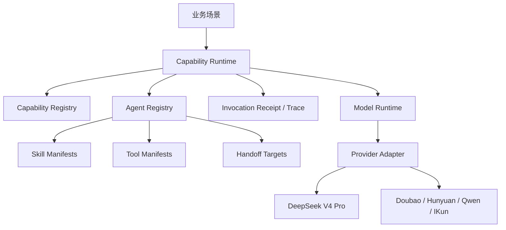

# AI 能力层架构

最后整理：2026-05-07

## 目标

模型不能只作为“多模型PK”里的按钮存在。项目需要一层可复用的 AI 能力抽象，让后续开放日、资产顾问、后台运营或工具编排都能按“能力”调用，而不是各自硬编码某个 provider 和模型。

## 分层

## 主流架构参考

- OpenAI Agents SDK 的核心形态是 `agent + tools + handoffs + guardrails + tracing`，适合做“谁负责、能用什么工具、什么时候交接、如何追踪”的运行时契约。
- MCP 把外部能力标准化为 `tools / resources / prompts`，适合未来接入第三方工具、数据资源和提示模板，而不是每个 provider 各写一套私有协议。
- Claude Skills 的形态是 `SKILL.md + scripts + resources` 的技能包，适合把可复用工作方式做成可发现、可迁移的 instruction/resource/script 组合。
- LangGraph 强调 graph/state/checkpoint/human-in-the-loop，适合以后做长流程、多步任务、可恢复执行；当前项目先保留 `executionMode` 和 `receipt` 口子，不急着引入完整图运行时。

本项目现在采用轻量内核：先把这些模式沉淀成 TypeScript 注册表和调用收据，等真实业务场景稳定后，再决定是否接入完整 SDK 或图运行时。

## 当前代码落点

- `lib/aiInvocationContracts.ts`
  - 定义 capability / execution / tool policy / guardrail / receipt 等基础合同。
- `lib/aiCapabilities.ts`
  - 定义能力目录。
  - 能力可以是 `llm`、`agent`、`subagent`、`tool_use`、`skill`。
  - 当前默认高能力模型是 `deepseek-v4-pro`。
- `lib/aiAgents.ts`
  - 定义 agent / subagent、默认模型、系统指令、可用 skill、可见 tool、handoff 目标和 guardrail。
- `lib/aiSkills.ts`
  - 定义可复用 skill manifest。
  - 当前先兼容 Claude Skills 的思想：instruction + resourceRefs + scriptRefs + allowedToolIds。
- `lib/aiTools.ts`
  - 定义 tool manifest、输入输出 schema、执行策略和风险等级。
  - 当前只注册，不自动执行。
- `lib/aiPlatform.ts`
  - 汇总 capability / agent / skill / tool，给 API 和后续业务层使用。
- `lib/aiCapabilityRuntime.ts`
  - 按 `capabilityId` 选择默认模型或允许模型。
  - 对外提供非流式和流式调用。
  - 注入 agent/capability 边界提示。
  - 返回 capability 元数据和 invocation receipt，便于调用方知道输出边界和调用轨迹。
- `lib/modelRuntime.ts`
  - 统一 provider 调度。
  - 多模型PK 和 AI 能力层共用同一模型调用入口。
- `api/ai-capabilities.ts`
  - 服务端能力入口。
  - 支持获取能力列表、非流式调用、流式调用。

## 能力目录

| capabilityId | 类型 | 默认模型 | 用途 |
| --- | --- | --- | --- |
| `general_reasoning` | `llm` | `deepseek-v4-pro` | 通用推理、总结、分析 |
| `code_analysis` | `llm` | `deepseek-v4-pro` | 代码分析和工程建议 |
| `strategy_advice` | `agent` | `deepseek-v4-pro` | 业务策略建议，输出 proposal |
| `narrative_draft` | `llm` | `deepseek-v4-pro` | 基于事实的文案和叙事草稿 |
| `tool_orchestration` | `tool_use` | `deepseek-v4-pro` | 未来工具计划、技能调用、子任务分派 |

## Agent / Skill / Tool 契约

- Capability 是业务调用入口，例如 `strategy_advice`。
- Agent 是执行人格和职责边界，例如 `strategy_advisor_agent`。
- Skill 是可复用工作方法，例如 `open_day_strategy`、`selling_houses_strategy`、`structured_tool_planning`。
- Tool 是服务端可见能力，例如 `open_day.score_preview`、`selling_houses.proposal_review`。
- Handoff 是显式交接目标，例如策略 agent 可以把文案任务交给叙事 agent，把工具计划交给工具编排 agent。
- Receipt 是每次调用的运行收据，包含 capability、agent、model、skills、tools、handoff targets、guardrails、trace。

当前工具策略：

- `no_tools`：纯模型能力。
- `plan_only`：模型可以规划工具，但不能声称已执行。
- `read_only`：只读工具可作为未来安全执行范围。
- `server_approved`：必须由服务端白名单、业务权限和人工确认后执行。

## 边界原则

- 业务场景调用能力，不直接调用 provider。
- provider adapter 只负责模型协议和错误处理。
- 能力层可以知道默认模型，但不能写业务事实。
- 资产顾问 `core/llm-boundary` 保持纯类型层，不引入 API key、fetch 或 provider。
- `strategy_advice` 和 `tool_orchestration` 先只产出建议或计划，不能直接执行行动。
- DeepSeek Pro 是项目核心 AI 能力默认模型；多模型PK 仍保留多模型对比自由。
- 工具执行必须服务端审批，模型输出的 tool plan 不是执行结果。
- Skill 可以引用资源和脚本，但资源读取、脚本执行也必须通过服务端权限边界。

## API 形态

- `GET /api/ai-capabilities`
  - 返回 capabilities。
  - 同时返回 platform manifest，包含 agent / skill / tool 注册表。
- `POST /api/ai-capabilities`
  - 输入 `capabilityId`、`prompt`、可选 `modelId`。
  - 默认走 capability 绑定的 `deepseek-v4-pro`。
  - 返回 `result.capability` 和 `result.receipt`。
- `POST /api/ai-capabilities?stream=1`
  - 流式输出 delta。
  - 完成事件包含最终 result、capability、modelId 和 receipt。

## 后续使用方向

- 多模型PK：继续使用 `compare`，但底层已复用 `modelRuntime`。
- 开放日：可用 `strategy_advice` 生成候选小区策略解释、参数调整建议。
- 资产顾问：可用 `narrative_draft` 写复盘文本，用 `strategy_advice` 生成行动建议 proposal。
- 工具/skill：后续把 `tool_orchestration` 的输出约束成结构化 tool plan，再由服务端白名单执行。

## 下一步扩展口

- 把 `tool_orchestration` 的输出改成严格 JSON schema。
- 给 `open_day.score_preview` 接真实只读 handler。
- 给 `selling_houses.proposal_review` 接资产顾问 proposal 校验器，但继续保持 `core/llm-boundary` 纯类型。
- 引入持久化 trace 表或日志文件，记录 receipt。
- 当长流程场景明确后，再引入图执行和 checkpoint。
