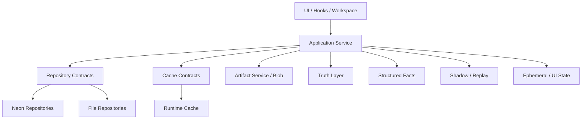

# 全局持久化与 DBA 统一设计

最后整理：2026-04-18

这份文档解决的是“全局怎么管”，不是某一条业务线的局部修补。

适用范围：

- `modules/open-day`
- `src/selling-houses`
- `server.ts` / `api/*`
- 本地 `localStorage`
- 本地 file fallback
- `Neon Postgres`
- `Blob / Runtime Cache`

## 一句话结论

这个项目后续不再按“每条业务线自己长一套持久化”来演进，而是统一遵循：

> 业务真相分层定义，持久化能力平台化接入，结构化事实与缓存/影子严格分离。

也就是：

1. 先定义谁是真相。
2. 再定义谁是结构化事实。
3. 再定义谁只是缓存、回放材料、影子表或 UI 状态。
4. 最后才决定写 Neon、file、Blob 还是 localStorage。

## 现状判断

### 1. `open-day`

当前已经接近“平台化持久化”：

- 有 application / repository / infrastructure 分层
- 有 `Neon / file / blob / runtime cache` 组合
- 有 `template + version`
- 有 `dataset / dataset_profile / analysis_run / snapshot / row`

结论：

- `open-day` 不是缺持久化
- `open-day` 缺的是全局治理接入标准

### 2. `selling-houses`

当前已经形成“快照真相 + 结构化影子”的稳定路线：

- `maintainer_game_runs.save_data` 是恢复真相
- `sync_version` 做云端 CAS
- 结构化表用于分析、排行榜、推荐、周节奏、事项和事件

结论：

- `selling-houses` 不是缺表
- `selling-houses` 缺的是持久化平台化和统一规则接入

### 3. 全局真正的问题

问题不在某一张表，而在三种不统一：

- 真相定义不统一
- fallback 语义不统一
- repository / platform 抽象深度不统一

## 全局统一原则

## 原则 1：每条业务线都必须先定义“唯一真相层”

任何模块都要先明确以下 4 类数据：

### A. 恢复真相

用于完整恢复业务运行状态。

要求：

- 必须可恢复
- 必须优先持久化
- 必须有明确所有者

当前映射：

- `selling-houses`: `maintainer_game_runs.save_data`
- `open-day`: 不存在单一运行世界，真相拆分为 `scenario version + dataset + analysis run`

### B. 结构化事实

用于查询、推荐、复盘、审计、报表。

要求：

- 尽量结构化
- 尽量追加式
- 不得依赖前端 UI 组件命名

### C. 派生影子 / 回放材料

用于辅助查询、回放、对账、分析。

要求：

- 可以从真相重建
- 不得成为主恢复来源
- 允许滞后、允许灰度

### D. 缓存 / UI 状态

用于加速或提升体验。

要求：

- 可以丢
- 不参与业务真相判断

## 原则 2：存储后端是实现细节，不是业务语义

后端类型：

- `localStorage`
- file repo
- `Neon Postgres`
- `Blob`
- runtime cache

统一要求：

- 业务语义由领域模型和 repository contract 决定
- 不是由具体后端行为反推业务逻辑

也就是说：

- 先定 contract
- 再接 `Neon`
- 再补 file fallback
- 再补 cache / blob

## 原则 3：优先追加，不轻易覆盖

适用对象：

- 方案
- 剧本
- 分析结果
- 事项生命周期
- 事件链

统一要求：

- 当前态可以更新
- 历史态尽量追加
- 版本实体必须带 `parent_id + version_no`

## 原则 4：影子表不影响主流程

所有影子写规则统一：

- 必须包在 `try/catch`
- 不允许阻断主保存
- 必须能从主真相重建
- 必须提供 `verify / rebuild` 能力

这条原则已经在 `selling-houses` 落地，后续作为全局标准。

## 原则 5：fallback 只保最小功能一致，不保完全等价实现

例如：

- file fallback 不要求和 Neon 的性能、索引、查询方式完全一致
- 但要求实体语义一致
- 关键字段一致
- 版本关系一致
- ID/时间语义一致

## 全局参考架构

## 各业务线统一设计

## 一、`open-day`

### 真相层

- `open_day_scenario_templates`
- `open_day_scenario_template_versions`
- `open_day_datasets`
- `open_day_dataset_profiles`
- `open_day_analysis_runs`

### 结构化事实层

- `open_day_analysis_run_rows`
- 方案模板摘要字段
- 数据集 profile 摘要字段

### 兼容/影子层

- `open_day_analysis_snapshots`
- `open_day_analysis_snapshot_rows`

### 缓存层

- analysis cache
- workbook parse cache

### 统一建议

后续 `open-day` 继续保持：

- `template + version`
- `dataset + profile`
- `run + rows`

不建议再退回单表大 JSON 模式。

## 二、`selling-houses`

### 真相层

- `maintainer_game_runs`
  - 其中 `save_data` 是恢复真相
  - `sync_version` 是并发真相控制

### 结构化事实层

- `maintainer_run_listings`
- `maintainer_listing_sellers`
- `maintainer_listing_competitiveness`
- `maintainer_listing_leads`
- `maintainer_lead_feedbacks`
- `maintainer_matters`
- `maintainer_matter_interactions`
- `maintainer_week_cycles`
- `maintainer_focus_meeting_entries`
- `maintainer_events`
- `maintainer_listing_flags`
- `maintainer_recommendations`
- `selling_houses_progress`
- `maintainer_leaderboard_entries`

### 影子层

这些结构化表当前都属于“由 `save_data` 派生出来的影子事实”：

- 它们用于查询和分析
- 但恢复仍然以 `save_data` 为准

### 统一建议

`selling-houses` 后续不应该直接再长成“单 repo + 单大文件逻辑”。

应分 3 步演进：

1. 保持 `save_data` 真相不动
2. 把 repository contract 抽出来
3. 再补 file fallback / platform resolver

## 三、通用会话与认证层

### 会话状态

例如：

- 激活 key
- 登录邮箱
- workspace 授权态

这类默认属于“客户端会话状态”，不是核心业务事实。

要求：

- 可放 `localStorage` / cookie
- 不进入业务分析库
- 与业务运行真相分离

## 统一 repository 设计

所有业务线后续统一采用：

### 1. Application Service

职责：

- 组织用例
- 协调真相、结构化事实、缓存、artifact

### 2. Repository Contract

职责：

- 只暴露领域语义
- 不暴露后端实现细节

### 3. Infrastructure Repository

职责：

- `Neon`
- file fallback
- cache adapter
- blob adapter

### 4. Platform Resolver

职责：

- 根据环境装配正确实现

`open-day` 已经基本是这个形态。
`selling-houses` 要向这个形态靠拢。

## 全局数据分类标准

每次新增数据对象时，必须先归类：

### 类型 A：真相对象

问题：

- 没它能不能恢复业务？

如果不能，就必须进真相层。

### 类型 B：版本对象

问题：

- 用户是否需要追历史？
- 旧版本是否有业务意义？

如果有，就必须版本化。

### 类型 C：事件对象

问题：

- 这是一次动作，还是一个状态？

如果是动作，就不要只写最终状态。

### 类型 D：影子对象

问题：

- 它是否可以从真相重建？

如果可以，就不要把它当恢复入口。

### 类型 E：缓存对象

问题：

- 丢了会不会影响业务真相？

如果不会，就是缓存。

## 全局 DBA SOP

## SOP 1：接需求先做“真相分型”

每个新增需求先回答：

1. 这是新真相，还是旧真相的新属性？
2. 这是结构化事实，还是影子派生？
3. 这是版本对象，还是覆盖对象？
4. 这是事件，还是状态？
5. 这是缓存，还是业务记录？

没有做完这个分型，不允许先加表。

## SOP 2：设计时必须给出 6 个结论

1. 真相源是谁
2. 主键是什么
3. 幂等键是什么
4. 时间语义是什么
5. fallback 怎么做
6. verify / rebuild / rollback 怎么做

## SOP 3：所有影子表必须带验证策略

至少要有其中之一：

- 计数对账
- 字段抽样对账
- rebuild 脚本

`selling-houses` 已经有了好例子，后续作为模板推广。

## SOP 4：schema 演进统一分三阶段

### 阶段 A：runtime ensure

适合早期快速迭代。

### 阶段 B：显式 migration

适合中期稳定演进。

### 阶段 C：review + rollout + rollback

适合正式生产治理。

当前建议：

- `open-day` 和 `selling-houses` 都还允许 runtime ensure
- 但后续 schema 复杂度继续上来时，要统一迁移体系

## SOP 5：文档与代码同时更新

每次持久化变更至少同步更新一项：

- 模块数据模型文档
- 全局统一设计
- module map
- durable decisions

## 全局改造计划

## P0：统一规则，不动读路径

目标：

- 先统一治理语言
- 不做大规模重构

动作：

- 固化本文档
- 把 `selling-houses` 明确纳入全局持久化规则
- 约束新增功能必须做真相分型

## P1：把 `selling-houses` 平台化

目标：

- 对齐 `open-day` 的 platform / repository 模式

动作：

- 新建 `selling-houses` repository contract
- 新建 platform resolver
- 后续再接 file fallback

## P2：统一迁移机制

目标：

- 不再完全依赖 runtime ensure

动作：

- 设计项目级 migration 目录
- 定义 migration review 模板
- 为两个业务线共用

## P3：统一巡检体系

目标：

- DBA 工作从“人工想起来才看”变成“固定巡检”

动作：

- 每条业务线有 verify
- 每个影子层有 rebuild
- 每周一次 schema / fallback / consistency 巡检

## 你现在可以怎么用这份设计

如果是短期迭代：

- 不用推翻现有实现
- 直接按本文档判断新增数据属于哪一层

如果是中期重构：

- 优先让 `selling-houses` 对齐 `open-day` 的 platform 模式

如果是 DBA 日常工作：

- 先巡检真相层
- 再巡检影子层
- 最后巡检 fallback 一致性

## 最终原则

全局只认这三句话：

1. 真相层先于实现层。
2. 结构化事实先于页面状态。
3. fallback 是可跑方案，不是业务语义标准。
