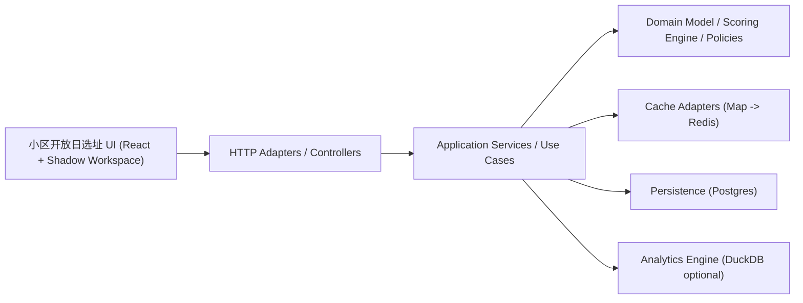

# 小区开放日选址 DDD Architecture

说明：本文档使用“小区开放日选址”作为对外产品名；代码内部仍保留 `open-day` 作为模块、接口与目录前缀，避免引入不必要的重命名风险。

## 目标

把当前“小区开放日选址页面”升级为可持续演进的测算中台：

- 前后端分离：前端负责上传、映射、参数仪表盘、结果呈现；后端负责解析、领域计算、缓存、配置管理、审计。
- 高内聚低耦合：测算规则聚合在“小区开放日选址”领域上下文内，避免散落在页面脚本、接口文件和工具函数中。
- 可扩展：后续可以增加“大区筛选”“策略包管理”“批量跑数”“导出”“异步任务”“AB 参数实验”而不推翻现有结构。
- 可加速：相同数据集 + 相同参数的重复计算直接命中缓存；更大规模时可切换到 Redis + Postgres + DuckDB。

## 当前识别出的上下文

这个仓库目前至少有 3 个 bounded contexts：

1. `Activation`
2. `AI Comparison`
3. `Site Selection`

这次重构只把“小区开放日选址”做成独立领域模块，避免和多模型 PK 工作台继续互相污染。

## 推荐分层

### Domain

只放业务规则，不放框架细节。

- `OpenDayConfig`
- `OpenDayMappings`
- `NormalizedOpenDayRow`
- `OpenDayScoringEngine`
- `OpenDayFormula`
- `EligibilityPolicy`
- `WaterlineResolver`

### Application

负责工作流编排，不直接承载业务规则。

- `OpenDayAnalysisService`
- `OpenDayCatalogService`
- `PresetCatalog`
- `ScoreOpenDayDataset` use case
- `PersistAnalysisSnapshot` use case
- `ScheduleRebuildWaterlines` use case

### Infrastructure

负责和外部资源打交道。

- Excel parser adapter
- Cache adapter
- Repository adapter
- Future: Redis, Postgres, S3/OSS, DuckDB

### Interfaces

负责 HTTP/队列/定时任务入口。

- `/api/parse-workbook`
- `/api/open-day-catalog`
- `/api/open-day-score`
- Future: `/api/open-day/configs`
- Future: `/api/open-day/analyses/:id`
- Future: `/api/open-day/jobs/rebuild`

## 这次代码里已经落下来的第一层骨架

当前已经新建：

- [openDay.types.ts](/Users/jiaqi/Documents/开放日测算/modules/open-day/domain/openDay.types.ts)
- [openDayScoringEngine.ts](/Users/jiaqi/Documents/开放日测算/modules/open-day/domain/openDayScoringEngine.ts)
- [openDayConfig.ts](/Users/jiaqi/Documents/开放日测算/modules/open-day/application/openDayConfig.ts)
- [openDayCatalogService.ts](/Users/jiaqi/Documents/开放日测算/modules/open-day/application/openDayCatalogService.ts)
- [openDayAnalysisService.ts](/Users/jiaqi/Documents/开放日测算/modules/open-day/application/openDayAnalysisService.ts)
- [openDayAnalysisCache.ts](/Users/jiaqi/Documents/开放日测算/modules/open-day/application/openDayAnalysisCache.ts)
- [inMemoryOpenDayAnalysisCache.ts](/Users/jiaqi/Documents/开放日测算/modules/open-day/infrastructure/inMemoryOpenDayAnalysisCache.ts)
- [openDayDatasetNormalizer.ts](/Users/jiaqi/Documents/开放日测算/modules/open-day/domain/openDayDatasetNormalizer.ts)
- [openDayWaterlineResolver.ts](/Users/jiaqi/Documents/开放日测算/modules/open-day/domain/openDayWaterlineResolver.ts)
- [openDayEligibilityPolicy.ts](/Users/jiaqi/Documents/开放日测算/modules/open-day/domain/openDayEligibilityPolicy.ts)
- [openDayTierPolicy.ts](/Users/jiaqi/Documents/开放日测算/modules/open-day/domain/openDayTierPolicy.ts)
- [openDayCatalogHandler.ts](/Users/jiaqi/Documents/开放日测算/modules/open-day/interfaces/http/openDayCatalogHandler.ts)
- [openDayScoreHandler.ts](/Users/jiaqi/Documents/开放日测算/modules/open-day/interfaces/http/openDayScoreHandler.ts)

这意味着“页面直接算分”和“页面直接定义策略”的耦合都已经开始被切开：

- 前端通过 `/api/open-day-catalog` 获取默认配置和策略包目录
- 前端通过 `/api/open-day-score` 请求后端领域服务
- 后端统一走配置合并、权重归一化、领域计算和缓存

这样以后无论是“新增策略包”“调默认 Alpha”“把 KPI 模式升级为审批后生效”，都不会再要求前端发版。

## 推荐的数据库与缓存体系

### 第一阶段：当前可用

- Cache: 进程内 `Map` + TTL
- Storage: 无持久化，适合单实例开发

优点：

- 代码最轻
- 已经能显著减少重复参数拖动带来的重复计算

缺点：

- 多实例不共享
- 重启丢缓存
- 不能审计历史测算

### 第二阶段：生产建议

#### Redis

用途：

- `dataset_fingerprint + config_fingerprint -> analysis_result`
- `upload_id -> parsed_workbook_payload`
- `preset_id -> resolved_config`

建议策略：

- Cache Aside
- TTL 5 到 30 分钟
- 结果缓存和解析缓存分开命名空间

#### Postgres

建议表：

1. `open_day_scenario_configs`
2. `open_day_uploads`
3. `open_day_analysis_snapshots`
4. `open_day_analysis_jobs`
5. `open_day_waterline_history`

建议字段示例：

`open_day_scenario_configs`

- `id`
- `name`
- `version`
- `config_json`
- `is_active`
- `created_by`
- `created_at`

`open_day_analysis_snapshots`

- `id`
- `dataset_fingerprint`
- `config_fingerprint`
- `resolved_waterlines_json`
- `summary_json`
- `results_json` 或单独结果表
- `cache_hit`
- `created_at`

### 第三阶段：大规模跑数建议

如果后面要对“全城所有盘、按月滚动、多版本策略回放、历史对比”做重分析，建议引入 DuckDB：

- 适合本地/服务端内嵌分析
- 对 CSV/Parquet/批量聚合非常快
- 非常适合做“按月回放 + 水位线批处理 + 历史快照比对”

建议使用方式：

- 上传后先落 Parquet
- DuckDB 负责历史分析、批量重算、离线报表
- 在线 API 仍由 Postgres + Redis 服务

## 推荐工作流

### 1. 上传预览

1. 前端上传 Excel
2. 后端解析 workbook，识别 sheet 与主表头
3. 返回预览行、headers、sheet 列表

### 2. 交互测算

1. 前端提交 `rows + mappings + config`
2. 后端生成 `dataset_fingerprint`
3. 后端生成 `config_fingerprint`
4. 先查 Redis / Cache
5. 未命中则进入 `OpenDayAnalysisService`
6. 领域层计算评分
7. 写缓存
8. 可选写快照表
9. 返回结果给前端

### 2.5. 配置目录加载

1. 前端打开开放日工作台
2. 请求 `/api/open-day-catalog`
3. 后端返回默认配置、策略包目录、各策略的 resolved config
4. 前端只负责渲染参数仪表盘，不再持有策略定义真源

### 3. 策略包治理

1. 业务侧保存“自动巡航 / 冲刺 / KPI / 深潜”等策略包
2. 每次测算引用一个配置版本
3. 快照中记录配置版本和 resolved waterlines
4. 后续可以做参数回放和效果复盘

### 4. 夜间批处理

1. 定时任务加载上月全量盘数据
2. 重新计算分位水位线
3. 更新 `waterline_history`
4. 刷新热点数据集缓存
5. 生成全城榜单快照

## 为什么这套架构更稳

- 页面不再持有核心业务规则，避免“UI 一改就伤到算法”。
- 页面不再持有策略包真源，避免“运营调策略必须改前端代码”。
- 引擎先产出统一的四个标准化指数，再交给 `formulaId` 对应的公式策略去算分，后续换公式不需要重写整条测算管道。
- 同一套领域服务可被页面、批处理、导出任务、公用 API 复用。
- 配置、缓存、结果快照被分离，后续做审计和回放更容易。
- 未来如果“小区开放日选址”真的变成独立服务，领域层可以原样迁出。

## 当前开发环境护栏

- 端口支持从 `PORT` 环境变量读取。
- 如果默认端口被占用，服务会自动向后寻找可用端口，避免本地多项目联调直接崩掉。
- HMR 端口支持通过 `VITE_HMR_PORT` 配置，避免和其他 Vite 项目争抢默认 websocket 端口。

## GitHub 开源参考

以下项目值得作为拆分能力时的“专业标尺”：

1. [Sairyss/domain-driven-hexagon](https://github.com/Sairyss/domain-driven-hexagon)
说明：
这个仓库把 DDD、Hexagonal、模块边界、应用服务、Ports/Adapters 讲得很完整，尤其适合约束“模块只能通过公开接口协作”。

2. [CodelyTV/typescript-ddd-example](https://github.com/CodelyTV/typescript-ddd-example)
说明：
这是很好的 TypeScript DDD 参考，适合学习“每个用例一个应用服务 / 垂直切片 / CQRS 风格目录”。

3. [alan2207/bulletproof-react](https://github.com/alan2207/bulletproof-react)
说明：
非常适合前端侧。它强调可扩展的项目结构、API layer、state management、performance 和 security，适合把“小区开放日选址”前端从“单文件脚本”升级成 feature-based React 模块。

4. [redis/node-redis](https://github.com/redis/node-redis)
说明：
适合缓存层。它在 README 里明确展示了 client-side caching 和 auto-pipelining，后续把当前内存缓存升级成 Redis 时很有参考价值。

5. [duckdb/duckdb](https://github.com/duckdb/duckdb)
说明：
适合历史批量分析和大盘重算。对于“全城楼盘 + 历史月份 + 策略回放”这种分析型任务，DuckDB 的模型非常合适。

6. [temporalio/samples-typescript](https://github.com/temporalio/samples-typescript)
说明：
如果未来把“夜间重算、导出、回放、异步审批”做成工作流，Temporal 的 TS 样例很适合拿来参考长流程编排。

7. [metabase/metabase](https://github.com/metabase/metabase)
说明：
它不是 DDD 教科书，但非常适合学习“分析产品”的产品化思路：数据连接、查询、缓存、结果展示、嵌入式分析。

## 下一步建议

### Phase 1

- 把“小区开放日选址”前端从 raw JS 继续迁到 React feature module
- 让前端改为读取后端返回的配置与 preset catalog

### Phase 2

- 增加 Postgres repositories
- 增加 Redis cache adapter
- 保存 analysis snapshots

### Phase 3

- 增加异步任务层
- 增加历史回放和对比
- 把 DuckDB 加入批量分析链路
