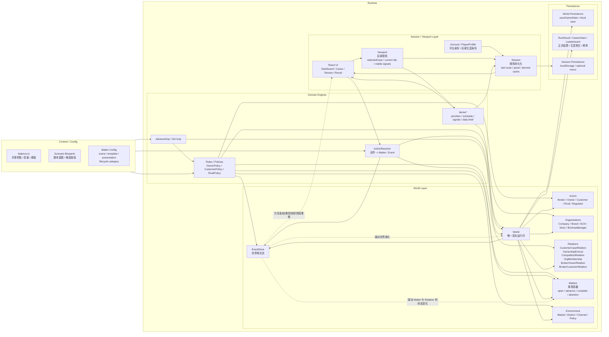
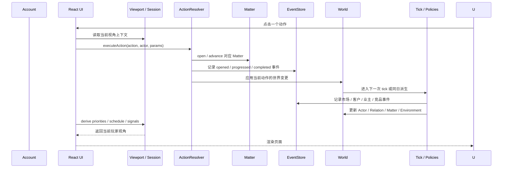
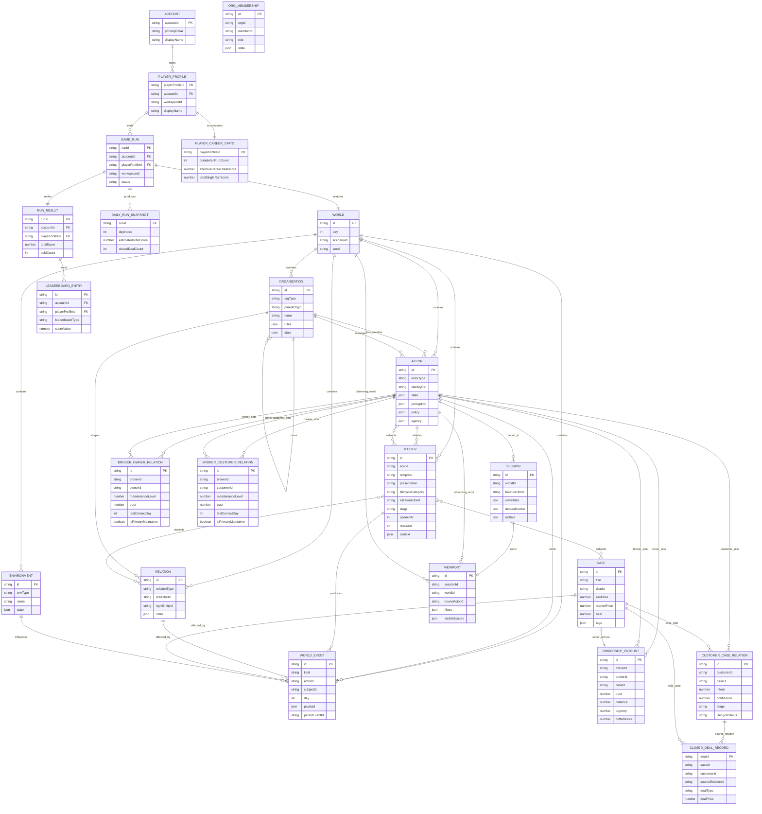
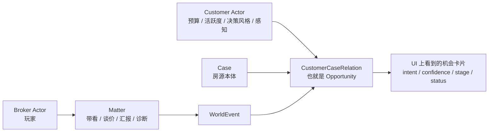
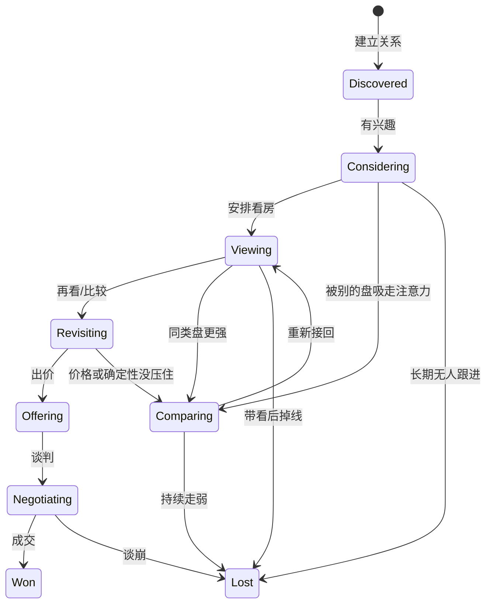
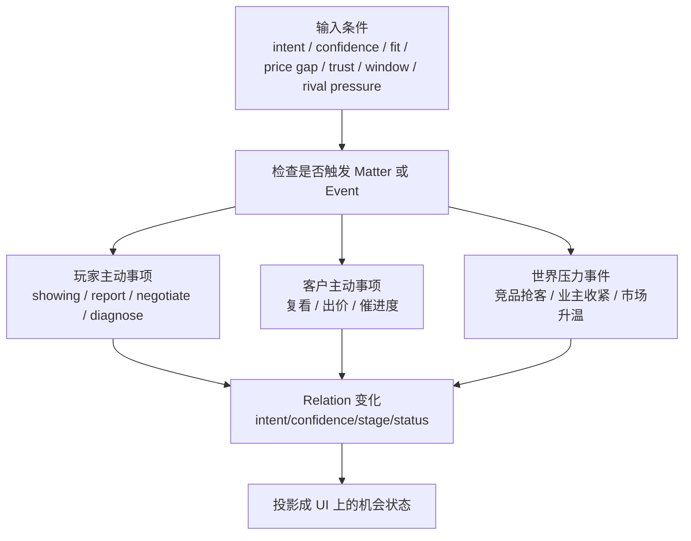
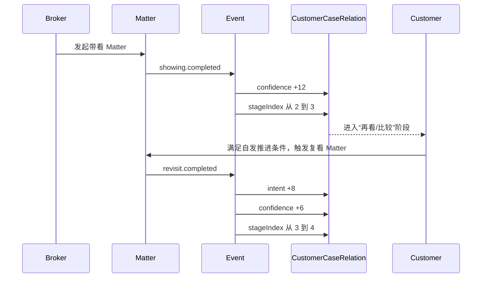

# 卖房（资产顾问）架构图与 ER 图

最后更新：2026-04-21

这份图只服务一件事：把 `selling-houses-master.md` 里讲的目标架构，画成一眼能对齐的图。

不是画现在代码里还没清干净的脏现状。
是画我们要去的那个形态：

- `World` 是主体
- `Player` 是绑定在 `Broker Actor` 上的 `Viewport`
- `Matter` 是一等公民
- `Opportunity` 本质上是 `Customer × Case` 的 `Relation`
- `Session` 只承载视角态，不承载世界真相

---

## 1. 总体架构图



---

## 2. 一句话理解

### 世界层

- `World` 里放真相
- 真相包括：Actor、Organization、Relation、Matter、Event、Environment

### 组织层

- `BrokerageCompany` 是经纪公司
- `Brand` 是公司对外经营的品牌
- `ACN` 是品牌内部的经纪人协作网络
- `Store` 是门店经营单元
- `BizAreaManager` 是商圈经理，管理一组经纪人
- `Broker` 属于某个 Store / Brand / ACN
- `Broker` 通过关系维护业主和客户，不直接拥有业主和客户

### 视角层

- `Viewport` 里放“玩家现在看到什么、点到哪、怎么排布”
- `Session` 里放“这个视角的持久化痕迹”

### 关键边界

- `World` 不知道 UI 长什么样
- `Session` 不决定世界怎么跑
- `Matter` 不是 UI 按钮，它是运行时工作项
- `EventStore` 不是滚动日志，它是世界事实链

---

## 3. 运行时主链路



---

## 4. ER 图

这张图回答的是“核心实体怎么连”。



---

## 5. 客户、机会、进展、概率

这一节专门回答四个问题：

1. 客户是什么
2. 客户和机会是什么关系
3. 机会怎么往前推进
4. 机会推进的概率怎么来

### 5.0 先分清三个东西

这里最容易混掉，所以先把概念钉死：

#### A. 客户画像（Customer Profile）

这是“这个人本来是什么样的人”。

例子：

- 预算区间
- 偏好户型
- 目标板块
- 决策风格
- 价格敏感度
- 家庭背景

特点：

- 偏静态
- 开局就有
- 不因为某一套房立刻改变

#### B. 客户状态（Customer Runtime State）

这是“这个客户当前整体处在什么状态”。

例子：

- 当前活跃度
- 当前疲劳度
- 当前注意力容量
- 当前在看几套房
- 当前首选是哪套
- 当前是否处于比较模式

特点：

- 是 customer 级运行时状态
- 会随着时间、市场、跟进节奏变化
- 会影响他对所有房子的推进能力

#### C. 机会状态（Opportunity / CustomerCaseRelation State）

这是“这个客户对这一套房，当前走到了哪一步”。

例子：

- fitScore
- affordabilityScore
- intent
- confidence
- stageIndex
- status
- rivalPullScore
- stagnationDays

特点：

- 是 relation 级状态
- 一定是 `customer + case` 联合出来的
- 同一个客户对不同房，机会状态可以完全不同

一句话：

- `客户画像` 不是 `客户状态`
- `客户状态` 也不是 `机会状态`
- `机会状态` 是三者里最具体、最局部的一层

### 5.1 客户和机会的关系

先把一句话说死：

- `Customer` 是 Actor
- `Opportunity` 不是独立 Actor
- `Opportunity` 本质上是 `Customer × Case` 的一条 `Relation`
- 一个 `Customer` 可以同时和很多套房建立 relation
- 一套 `Case` 也可以同时被很多个客户关注

所以这里是标准的 **多对多**：

- `Customer 1 -- N CustomerCaseRelation`
- `Case 1 -- N CustomerCaseRelation`
- `Customer N -- N Case` 通过 `CustomerCaseRelation` 连接

也就是说：

- 客户是“会自己决策的人”
- 机会是“这个客户和这套房当前走到哪一步了”
- 推进不是“客户整体升级”，而是“客户对某一套房的关系升级”



### 5.2 机会的状态，不是一个数字

`stageIndex` 只是压缩表达。

真正上应该同时看四层：

1. `relation existence`
   这位客户和这套房有没有建立关系
2. `intent / confidence`
   他想不想买、他觉得成不成
3. `stageIndex`
   当前走到了解 / 看房 / 再看 / 出价 / 谈判哪一步
4. `status`
   是在推进、比较、停滞、流失、成交

更重要的是：

- 这些状态是 **relation 级**
- 不是 customer 级

所以不要再写成这种混合模型：

- `customer.status = stageIndex`
- `customer.intent = 对某一套房的意向`
- `customer.confidence = 对某一套房的成交把握`

这些都应该属于 `CustomerCaseRelation`。

也就是同一个客户可以出现这种情况：

- 对 A 房：`stageIndex = 4`，快出价
- 对 B 房：`stageIndex = 2`，还在比较
- 对 C 房：`status = lost`，已经不看了

建议把它理解成下面这个状态机：



### 5.3 什么东西推动机会进展

机会不会自己凭空往前走。

进展来源应该分成 3 类：

1. `Broker-initiated Matter`
   玩家主动做的事，比如带看、汇报、调价沟通、谈判
2. `Customer-initiated Matter`
   客户自己往前走，比如主动复看、主动出价、主动催推进
3. `World pressure`
   市场、竞品、窗口、业主情绪变化，对 relation 造成正负冲击

但最关键的一句要补上：

> **每一条机会的进展，本质上是“客户状态 × 房源状态 × 最近交互”的结果。**

可以拆成三组输入：

#### A. 客户画像输入

- 预算是否覆盖
- 户型偏好是否匹配
- 板块偏好是否匹配
- 决策风格是否偏快
- 价格敏感度高不高

#### B. 客户状态输入

- 当前活跃度
- 当前疲劳度
- 还能同时看几套房
- 当前首选是否已存在
- 当前整体是不是处于比较态

#### C. 房源侧输入

- 房子的吸引力是否高
- 房源 fit 是否高
- 价格是否合适
- 卖点是否清晰
- 当前热度和竞争力
- 业主是否配合

#### D. 交互侧输入

- 最近有没有做推广动作
- 推广动作带来的曝光和到访有没有变强
- 最近有没有被跟进
- 最近一次带看反馈如何
- 最近一次谈价有没有把信心打掉
- 最近有没有被竞品抢走注意力

所以更对的因果链是：



### 5.4 机会发生进展的概率，到底怎么理解

现在最容易说糊的地方就是“概率”。

我建议分两层理解：

#### 第一层：先过门槛

不是所有 relation 都有资格进展。

先过一层门槛判断：

- customer 还有没有“注意力槽位”
- `intent` 到没到最小值
- `confidence` 到没到最小值
- 房子的基础吸引力有没有过线
- `fit` 是否足够
- 预算匹配是否过线
- 最近是否刚被竞品拉走
- 当前是不是停滞太久
- 房源价格是不是太离谱

只有过门槛，才进入概率判断。

#### 第二层：再算概率

过门槛后，不是 100% 晋级，而是“有条件的概率推进”。

这个概率不该是单一硬币。
它应该来自一组因素：

```text
P(advance relation r[c,case]) =
  baseRate
  + attractivenessBoost(case)
  + fitBoost(customerProfile, case)
  + affordabilityBoost(customerProfile, case)
  + demandMatchBoost(customerProfile, case)
  + intentBoost(relation)
  + confidenceBoost(relation)
  + activityBoost(customerState)
  + recentTouchBoost(relation)
  + marketingBoost(case, recentActions)
  + storyClarityBoost(case)
  + priceAlignmentBoost(case, customerProfile)
  - rivalPressurePenalty(relation, market)
  - compareLoadPenalty(customerState)
  - stagnationPenalty(relation)
  - fatiguePenalty(customerState)
```

这些都应该进 `balance.ts`，而不是散在引擎里。

如果再说得更工程一点，可以拆成两步：

```text
1. score = Σ(正向因子) - Σ(负向因子)
2. probability = clamp(sigmoid(score), minRate, maxRate)
```

这样好处是：

- 因子能解释
- 概率能调
- 不会因为单一硬币让人感觉“突然就晋级了”

如果只保留最核心的人话版本，其实就是三句话：

1. 这套房本身够不够吸引人
2. 最近推广和跟进有没有把这套房推到客户面前
3. 这个客户的需求和预算，和这套房到底匹不匹配

这三件事一起决定机会会不会往前走。

### 5.4.1 我建议的 relation 字段

为了真能算这件事，`CustomerCaseRelation` 最少应有这些字段：

```text
fitScore                客户和房子的长期匹配
affordabilityScore      预算匹配度
demandMatchScore        客户需求和房子的匹配度
attractivenessScore     房子本身的吸引力
marketingExposureScore  最近推广动作带来的曝光强度
intent                  想买程度
confidence              觉得能不能成
stageIndex              当前阶段
status                  engaged / comparing / stalled / lost / won
selected                当前是不是客户心里的第一选择
compareRank             当前在客户候选池里的排序
recentTouchScore        最近是否被有效跟进
stagnationDays          卡了几天没动
rivalPullScore          被竞品拉走的强度
lastAdvanceDay          上次前进是哪天
```

其中：

- `fitScore / affordabilityScore / demandMatchScore` 更偏静态
- `attractivenessScore` 是房源长期吸引力在 relation 上的投影
- `marketingExposureScore / intent / confidence / rivalPullScore / recentTouchScore` 更偏动态
- `stageIndex / status` 是最终投影

而 `Customer` 自己更适合保留：

```text
profile                静态画像
activity               当前活跃度
fatigue                当前疲劳度
attentionCapacity      当前最多能同时认真看几套
selectedRelationId     当前第一选择
activeRelationIds[]    当前还在看哪些房
decisionMode           当前是果断、平衡还是犹豫
```

### 5.5 推荐的机会推进机制

如果按目标架构，我建议用这个规则：

#### A. 玩家动作推进

- 玩家执行一个 Matter
- Matter 完成后，直接产出对应事件
- 事件再改变 relation
- 这是“强推进”

例子：

- 带看成功 -> `confidence +12`, `stageIndex +1`
- 定价沟通谈顺 -> `confidence +8`, `comparing risk -10`
- 小红书推广 / 开放日做得好 -> `marketingExposureScore +X`, `intent +Y`

#### B. 客户自发推进

- 每个 tick 检查 relation 是否满足“自发推进门槛”
- 满足后，按参数化概率触发一个 `customer-initiated Matter`
- 这个 Matter 立即完成，产出 `opportunity.advanced`

这是“弱推进”，但更真实。

#### C. 竞品与世界反作用

- 竞品更强，不一定立刻流失
- 先表现为：
  - `intent` 降
  - `confidence` 降
  - `status = comparing`
- 连续几次没接住，才真正 `lost`

这样比“直接随机掉线”更可解释。

### 5.5.1 客户为什么能同时推进多套房

因为客户不是一次只存在于一条 relation 里。

更合理的做法是：

- customer 维护一个 `activeRelations[]`
- 每天只会有 1 个 `selected relation`
- 可以有 2-3 个 `comparing relations`
- 超出注意力上限的 relation 会自然衰减

所以正确模型不是：

- `Customer -> one Opportunity`

而是：

- `Customer -> many Relations`
- `其中一条 selected`
- `其余几条 competing / fading`

### 5.6 一个机会推进的完整例子



### 5.7 结论

所以这四句话最重要：

1. 客户是主体，机会不是主体
2. 机会是客户和房源之间的一条关系，而且是一张多对多关系网
3. 机会进展不是只看 `stageIndex`，而是看“客户 × 房源 × 交互”的 relation 整体状态
4. 机会推进概率不是一颗裸骰子，而是“先过门槛，再按因素算概率”

如果再压缩成一句业务话，就是：

> 机会会不会往前走，取决于这套房够不够吸引人、最近有没有被有效推到客户面前、以及这个客户的需求和预算到底和这套房匹不匹配。

---

## 6. 实体职责说明

### World

- 只放世界真相
- 不放 UI 文案
- 不放“当前展开哪个 panel”

### Actor

- 所有会自己做决定的主体
- 包括玩家 broker，也包括 owner、customer、rival

### Case

- 房子本身
- 是交易客体，不是业主本人

### OwnershipEntrust

- 业主和 broker 围绕一套房的持续关系
- `trust / patience / urgency / bottomPrice` 更应该挂这里，或者挂 Owner.state，再通过 relation 暴露

### CustomerCaseRelation

- 也就是现在的 `Opportunity` 本质
- 表示某个客户和某套房之间的关系状态
- `intent / confidence / stageIndex` 应该留在这里

### Matter

- 一次具体工作项
- 例如：谈底价、做诊断、安排带看、推进签约
- Matter 结束后，才去推动 Relation 或 Actor 状态变化

### WorldEvent

- 记录事实，不是只给 UI 看
- 后面结果页、复盘页、回放，都要靠它

### Session / Viewport

- 只管“玩家怎么看”
- 可以记住：
  - 上次看哪套房
  - 上次停在哪个 tab
  - 上次派生出的 priorities 快照
- 不应该决定：
  - 客户是否晋级
  - 业主是否降价
  - 竞品是否抢走客户

---

## 7. 现在最重要的 4 条边界

1. `Case != Owner`
   现在很多 owner 字段还挂在 case 上，目标是拆开。

2. `Opportunity = CustomerCaseRelation`
   它不是独立宇宙里的“线索卡片”，它是客户和房源之间的一条关系。

3. `Matter != Action Button`
   按钮只是入口，Matter 才是运行时事项。

4. `Session != World Save`
   Session 是玩家视角态，World Save 是世界真相，两个不要再混。

---

## 8. 如果拿这两张图去评审，重点看什么

评审时只问下面这些问题就够了：

- 这个字段到底属于 World、Actor、Relation、Matter 还是 Session？
- 这个动作产生的是一个瞬时 Event，还是一个持续中的 Matter？
- 这个变化是世界真相，还是玩家视角派生？
- 这个 PR 是在让世界更真实，还是又把东西塞回 GameState 大对象里？

---

## 9. 建议配套动作

这份图出来后，建议马上做三件事：

1. 在 `selling-houses-master.md` 里链接这份图
2. 把现有字段按这份 ER 图做一次归属盘点
3. 后续所有架构 PR，都要求作者标注“这次改的是哪几个实体和关系”
