# 我是王牌资产顾问 · 云端数据模型（融合版）

这版设计把两条路线融合到一起：

- 保留 `run + sync_version + leaderboard` 的轻快照能力，方便先把云存档跑起来
- 同时把玩法主轴拆成结构化表，围绕 `画像 / 阶段 / 竞争力 / 事项 / 交互` 建模

一句话总结：

> 运行层保快照兜底，玩法层做结构化拆表。

## 设计主轴

这套系统的核心主轴有 4 个：

- 业主画像
- 房源阶段
- 好房分
- 共享商圈盘面

再叠加 4 个运行层：

- 整局
- 房源
- 商圈外部对象
- 事项 / 事件

## 总体 ER

```mermaid
erDiagram
    MAINTAINER_USERS ||--o{ MAINTAINER_GAME_RUNS : "owns"
    MAINTAINER_USERS ||--o{ MAINTAINER_LEADERBOARD_ENTRIES : "records"
    MAINTAINER_GAME_RUNS ||--o| MAINTAINER_LEADERBOARD_ENTRIES : "finalizes to"

    MAINTAINER_GAME_RUNS ||--o{ MAINTAINER_RUN_LISTINGS : "contains"
    MAINTAINER_GAME_RUNS ||--o{ MAINTAINER_RIVAL_STORES : "contains rival stores"
    MAINTAINER_GAME_RUNS ||--o{ MAINTAINER_RIVAL_LISTINGS : "contains rival listings"
    MAINTAINER_GAME_RUNS ||--o{ MAINTAINER_MARKET_DAILY_EVENTS : "spawns daily events"
    MAINTAINER_GAME_RUNS ||--o{ MAINTAINER_RULE_EFFECTS : "enables temporary rules"
    MAINTAINER_GAME_RUNS ||--o{ MAINTAINER_MATTERS : "generates"
    MAINTAINER_GAME_RUNS ||--o{ MAINTAINER_WEEK_CYCLES : "organizes"
    MAINTAINER_GAME_RUNS ||--o{ MAINTAINER_EVENTS : "records"
    MAINTAINER_GAME_RUNS ||--o{ MAINTAINER_RECOMMENDATIONS : "suggests"

    MAINTAINER_RUN_LISTINGS ||--|| MAINTAINER_LISTING_SELLERS : "has seller state"
    MAINTAINER_RUN_LISTINGS ||--|| MAINTAINER_LISTING_COMPETITIVENESS : "has competitiveness"
    MAINTAINER_RUN_LISTINGS ||--o{ MAINTAINER_LISTING_LEADS : "contains leads"
    MAINTAINER_RUN_LISTINGS ||--o{ MAINTAINER_LISTING_FLAGS : "accumulates"
    MAINTAINER_RUN_LISTINGS ||--o{ MAINTAINER_MATTERS : "triggers"
    MAINTAINER_RUN_LISTINGS ||--o{ MAINTAINER_EVENTS : "suffers"

    MAINTAINER_LISTING_LEADS ||--o{ MAINTAINER_LEAD_FEEDBACKS : "collects"
    MAINTAINER_MATTERS ||--o{ MAINTAINER_MATTER_INTERACTIONS : "plays"
    MAINTAINER_RIVAL_STORES ||--o{ MAINTAINER_RIVAL_LISTINGS : "operates"

    MAINTAINER_WEEK_CYCLES ||--o{ MAINTAINER_FOCUS_MEETING_ENTRIES : "contains"

    SELLER_PROFILE_DEFINITIONS ||--o{ MAINTAINER_RUN_LISTINGS : "labels"
    SELLER_PROFILE_DEFINITIONS ||--o{ MAINTAINER_LISTING_SELLERS : "defines"
    LISTING_STAGE_DEFINITIONS ||--o{ MAINTAINER_RUN_LISTINGS : "stages"
    MATTER_TYPE_DEFINITIONS ||--o{ MAINTAINER_MATTERS : "types"
    INTERACTION_TEMPLATE_DEFINITIONS ||--o{ MAINTAINER_MATTERS : "drives"
    EVENT_TYPE_DEFINITIONS ||--o{ MAINTAINER_EVENTS : "types"
```

## 一、运行主表

### `maintainer_game_runs`

一局游戏一条，承接：

- 当前进度
- 核心经济值
- 乐观锁同步版本
- 全量快照兜底

关键字段：

- `run_id`
- `user_id`
- `season_id`
- `status`
- `schema_version`
- `day`
- `cash`
- `energy`
- `reputation`
- `sold_count`
- `withdrawn_count`
- `score`
- `save_data`
- `daily_logs`
- `sync_version`
- `started_at`
- `finished_at`
- `last_played_at`
- `client_updated_at`
- `updated_at`

### 为什么保留 `save_data`

因为当前前端状态机已经很完整，保留全量 JSONB 快照可以：

- 减少首版 API 接入成本
- 避免前端状态被数据库结构反向绑死
- 让结构化表和快照并行演进

## 商圈共享盘面主轴

这条线现在需要明确一件事：

- 玩家不是唯一经营者

所以云端数据模型不能只建：

- 我方房
- 我方事项
- 我方事件

还必须能表达：

- 同一局里还有哪些外部门店
- 这些门店手上有哪些外部竞品盘
- 这些外部竞品盘今天对玩家造成了什么影响
- 今天整个商圈发生了什么主事件

也就是说，这套模型以后不只是“玩家经营数据模型”，而是“共享商圈盘面数据模型”。

## 二、房源核心表

### `maintainer_run_listings`

每局里的每套房一条，是玩法主表。

它回答的是：

- 这套盘在哪个经营阶段
- 这套盘当前能不能打
- 这套盘最缺什么

关键字段：

- `run_listing_id`
- `run_id`
- `template_listing_id`
- `title`
- `community`
- `district`
- `layout`
- `area`
- `status`
- `listing_stage_code`
- `seller_profile_code`
- `competitiveness_score`
- `pricing_power`
- `product_power`
- `story_power`
- `traffic_power`
- `conversion_power`
- `listing_heat`
- `showing_readiness`
- `focus_score`
- `active_lead_count`
- `high_intent_lead_count`
- `shadow_lead_count`
- `last_major_event_at`
- `updated_at`

## 三、业主状态表

### `maintainer_listing_sellers`

一套盘一条动态业主状态。

注意这里区分：

- `seller_profile_code`：画像类别
- 动态状态字段：运行中的实时数值

关键字段：

- `seller_profile_code`
- `seller_name`
- `pressure_source_code`
- `seller_trust`
- `seller_confidence`
- `seller_patience`
- `price_flex_readiness`
- `cooperation_level`
- `emotion_level`
- `communication_debt`
- `feedback_preference_code`
- `cooperation_style_code`
- `trust_baseline`

## 四、好房分拆解表

### `maintainer_listing_competitiveness`

这张表专门负责“为什么这套盘现在强/弱”。

主表只保常用查询字段，这张表保细拆。

关键字段：

- `overall_score`
- `pricing_power`
- `product_power`
- `story_power`
- `traffic_power`
- `conversion_power`
- `pricing_position_score`
- `market_fit_score`
- `story_clarity_score`
- `open_day_readiness_score`
- `broker_pushability_score`
- `showing_feedback_score`
- `breakdown_payload`

## 五、线索与漏斗

### `maintainer_listing_leads`

每个客户机会一条。

关键字段：

- `lead_source_type`
- `visibility`
- `stage_code`
- `intent_score`
- `confidence_score`
- `budget_fit_score`
- `days_to_cold`
- `broker_name`
- `is_key_lead`

### `maintainer_lead_feedbacks`

带看、复看、议价、异议反馈日志。

这张表是后续“带看反馈整理”“客户反对点归因”的基础。

## 六、事项系统

### `maintainer_matters`

这是玩法的心脏。

它承接：

- 固定事项
- 事件触发事项
- 连锁事项
- 推荐系统

关键字段：

- `type_code`
- `source_code`
- `status`
- `stakeholder_code`
- `interaction_template_code`
- `priority_score`
- `deadline_day`
- `context_payload`
- `recommended_action_payload`
- `resolution_code`
- `resolution_summary`

## 七、商圈外部门店与外部竞品

### `maintainer_rival_stores`

同一局里出现的外部门店。

这张表不是为了完整模拟另一位玩家，而是为了明确：

- 这一局有哪些外部经营主体
- 它们主要在什么商圈发力
- 它们的经营风格是什么

建议字段：

- `rival_store_id`
- `run_id`
- `name`
- `district_focus`
- `style_code`
- `pressure_profile`
- `created_at`
- `updated_at`

### `maintainer_rival_listings`

这张表表达商圈里不归玩家经营、但会持续影响玩家局面的外部竞品盘。

这些盘不需要拥有玩家房源那样完整的业主与事项状态。

它们最重要的是几个影响槽位：

- `price_anchor_power`
- `lead_siphon_power`
- `story_strength`
- `freshness_score`
- `days_left`
- `status`

建议字段：

- `rival_listing_id`
- `run_id`
- `rival_store_id`
- `market_cell_id`
- `title`
- `segment_code`
- `ask_price`
- `price_anchor_power`
- `lead_siphon_power`
- `story_strength`
- `freshness_score`
- `days_left`
- `source_code`
- `status`
- `spawned_by_event_id`
- `updated_at`

这张表的目的不是给玩家操作，而是给引擎施压。

## 八、每日事件与临时规则

### `maintainer_market_daily_events`

每日事件首先是“今天整个商圈发生了什么”，而不是只给某套房偷偷加减数值。

建议字段：

- `daily_event_id`
- `run_id`
- `day_index`
- `layer_code`
- `event_type_code`
- `title`
- `message`
- `tone`
- `payload`
- `created_at`

这里的 `layer_code` 建议区分：

- `state`
- `board`
- `rule`

这样“业主家人催卖”“新竞品入场”“本周推广金减半”都能落到同一套模型里。

### `maintainer_rule_effects`

短期规则变化不该只写进日志，应有结构化落表，便于回放与校验。

建议字段：

- `rule_effect_id`
- `run_id`
- `source_event_id`
- `rule_key`
- `modifier_payload`
- `start_day`
- `end_day`
- `is_active`
- `created_at`

## 九、最重要的建模原则

以后这条线的结构化建模统一遵守下面三句：

- 玩家经营盘和外部竞品盘分开建模
- 客户和价格锚属于共享商圈，不属于玩家私有
- 每日事件首先作用于盘面层，再传导到单房层

### `maintainer_matter_interactions`

一条事项内的多轮互动。

没有这张表，就很难做：

- 回放
- 复盘
- 选项调优
- prompt / 模板迭代

关键字段：

- `turn_index`
- `actor_code`
- `prompt_text`
- `player_choice_code`
- `response_text`
- `outcome_code`
- `effects_payload`

## 七、周节奏系统

### `maintainer_week_cycles`

一周一条，承接周主题和节奏槽位：

- `theme_code`
- `focus_meeting_day`
- `weekly_feedback_day`
- `weekend_peak_day`
- `focus_slots`
- `open_day_slots`
- `schedule_payload`

### `maintainer_focus_meeting_entries`

“房源聚焦会”的提报记录。

这块很关键，因为它不是普通日志，而是带决策结果的经营动作。

## 八、事件系统

### `maintainer_events`

事件和事项必须分开。

- 事件：发生了什么
- 事项：你要处理什么

字段包括：

- `event_type_code`
- `severity_code`
- `source_code`
- `title`
- `summary`
- `payload`
- `caused_matter_id`

## 九、长期痕迹系统

### `maintainer_listing_flags`

用来存“后遗症”与长期状态，不建议全塞在 JSON 里。

例子：

- `seller_accepts_market_feedback`
- `focus_meeting_rejected_recently`
- `open_day_failed_once`
- `broker_trust_high`
- `needs_price_reposition`

## 十、字典表

当前 schema 里已经预留：

- `seller_profile_definitions`
- `listing_stage_definitions`
- `matter_type_definitions`
- `interaction_template_definitions`
- `event_type_definitions`

这样做的好处是：

- 前后端不会把 code 写死在业务表里
- 后面调文案和玩法迭代不会越来越乱

## 十一、推荐系统

### `maintainer_recommendations`

不是首批必接，但表已经预留，方便后面做：

- 今日先处理哪个事项
- 不处理会怎样
- 预期收益是什么

## 结构化 vs JSONB

### 必须结构化的

因为这些字段要参与筛选、排序、推荐、分析：

- `listing_stage_code`
- `seller_profile_code`
- `competitiveness_score`
- `seller_trust`
- `seller_confidence`
- `matter.status`
- `matter.priority_score`
- `lead.stage_code`

### 适合 JSONB 的

因为这些上下文变化快、结构不稳定：

- `save_data`
- `daily_logs`
- `context_payload`
- `recommended_action_payload`
- `effects_payload`
- `proposal_payload`
- `breakdown_payload`
- `schedule_payload`
- `payload`

## 同步策略

`sync_version` 仍然保留在 `maintainer_game_runs`，作为多端同步的主入口。

推荐服务端使用 compare-and-swap：

1. 客户端提交 `expectedSyncVersion`
2. 服务端要求 `expectedSyncVersion == DB.sync_version`
3. 成功后服务端把 `sync_version` 加一

不要直接用“谁传得更大谁覆盖”。

## 当前代码落点

当前可执行 schema 在：

- [src/selling-houses/infrastructure/neonGameDatabase.ts](/Users/jiaqi/Documents/开放日测算/src/selling-houses/infrastructure/neonGameDatabase.ts)

## 建议接入顺序

不要一次性把所有表都接进 API。

推荐顺序：

1. `maintainer_users`
2. `maintainer_game_runs`
3. `maintainer_run_listings`
4. `maintainer_matters`
5. `maintainer_matter_interactions`
6. `maintainer_week_cycles`
7. `maintainer_focus_meeting_entries`
8. `maintainer_listing_leads`
9. `maintainer_lead_feedbacks`
10. `maintainer_events`
11. `maintainer_listing_flags`
12. `maintainer_recommendations`

这样前 4 到 5 张表先接起来，玩法骨架就能跑。

## 最核心的设计判断

这套数据库不应该再只围绕：

- case
- event log

来设计。

它现在真正的主链路应该是：

> `run -> listing -> seller/stage/competitiveness -> matter -> interaction`

而 `leaderboard`、`events`、`flags`、`recommendations` 是围绕这条主链路展开的配套系统。
