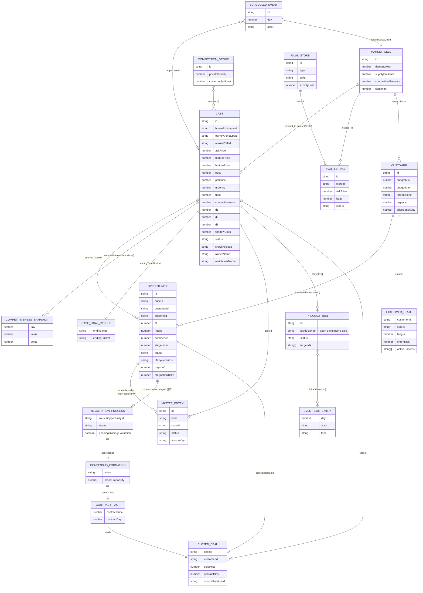
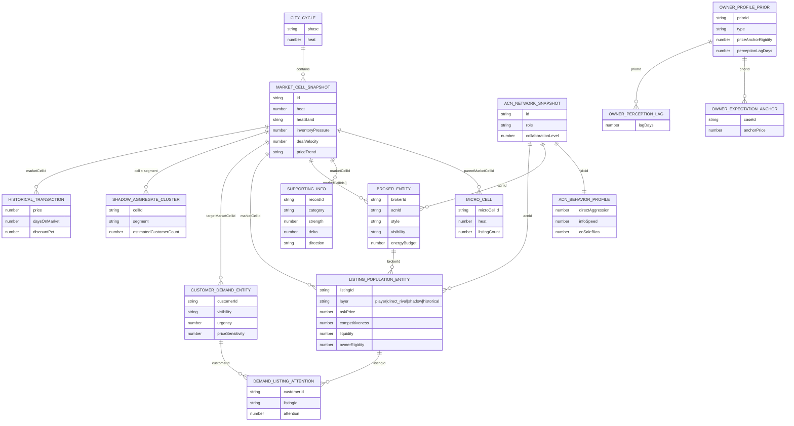
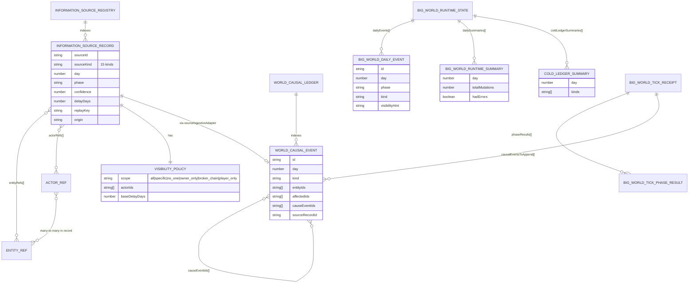
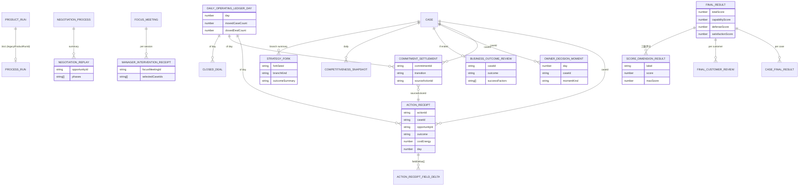

# 王牌资产顾问 · 实体关系全景图

> 生成日期：2026-05-21
> 数据来源：`src/selling-houses/` 当前代码（非文档推导）
> 适用范围：理解系统真实的世界结构与实体关系，用于会议/复盘/新人 onboarding
> 阅读方式：总—分（六张分图）—总

---

## 总

按代码事实，系统里的实体分 **6 层**，约 **80+ 个类型**。它们不是平铺一张图能讲清的，因为：

1. **同一概念有"多套并行表达"**：`Case`（legacy）↔ `AssetCase`（母模型视图）↔ `ListingPopulationEntity`（大世界种群）
2. **关系本身也是实体**：`OwnerCaseRelation`、`CustomerCaseOpportunity`、`CaseCompetitionRelation` 都有独立类型
3. **评价 / 票据 / 事件**全部独立成实体，不内联到主实体上

下面用**分层 ER 图**来画，每一层独立成图但用同名实体衔接。

---

## 分

### 图 1：六层全景（实体大类的归属）

```mermaid
flowchart TB
  subgraph L1 ["① 静态内容（WorldSpec / Scenario）"]
    direction LR
    WS[WorldSpec]
    SD[ScenarioDefinition]
    HP[HousePrototype]
    OA[OwnerArchetype]
    CP_T[CustomerProfile 池]
    CH[ChannelProfile]
    RA[RivalStoreArchetype / RivalListingArchetype]
    SC[ScenarioCase]
    CG[CompetitionGroup]
    RET[RandomEventTemplate]
    DET[DailyEventTemplate]
    ST[SignalTemplate]
  end

  subgraph L2 ["② 隐藏真相 BigWorldBootstrap.hiddenTruth"]
    direction LR
    CCY[CityCycleState]
    MCS[MarketCellSnapshot]
    MIC[MicroCell]
    ACNS[ACNNetworkSnapshot]
    ACNP[AcnNetwork+BehaviorProfile]
    SI[SupportingInfoRecord]
    OPP[OwnerProfilePrior]
    OEA[OwnerExpectationAnchor]
    OPL[OwnerPerceptionLag]
  end

  subgraph L3 ["③ 物化与冷聚合 materialized + coldAggregate"]
    direction LR
    BE[BrokerEntity]
    LPE[ListingPopulationEntity]
    CDE[CustomerDemandEntity]
    DLA[DemandListingAttention]
    SAC[ShadowAggregateCluster]
    HTS[HistoricalTransactionSummary]
  end

  subgraph L4 ["④ 玩家盘面 GameState 主体"]
    direction LR
    CASE[Case]
    OPP_E[Opportunity]
    CUS[CustomerProfile/State]
    MC[MarketCell]
    RS[RivalStore]
    RL[RivalListing]
    SM[ShadowMarketState]
    MAT[MatterEntry]
    PR[ProductRun]
    SCH[ScheduleEntry/PriorityEntry]
    BUD[BudgetTransaction]
  end

  subgraph L5 ["⑤ 母模型读写源 core/world-state"]
    direction LR
    AC[AssetCase]
    OWN[Owner]
    BRK[Broker]
    CUST[Customer]
    REG[Region]
    STO[Store]
    BOR[BrokerOwnerRelation]
    OCR[OwnerCaseRelation]
    CCO[CustomerCaseOpportunity]
    CCR[CaseCompetitionRelation]
    NP[NegotiationProcess]
    CF[ConsensusFormation]
    CT[ContractFact]
    OCS[OpportunityClosureSet]
    PRUN[ProcessRun]
    ODR[OpenDayRun]
    SSR[SinceritySaleRun]
  end

  subgraph L6 ["⑥ 信息 / 因果 / 票据"]
    direction LR
    ISR[InformationSourceRecord×15]
    WCE[WorldCausalEvent×9]
    BWE[BigWorldDailyEvent]
    WDE[WorldDomainEvent]
    AR[ActionReceipt]
    CS[CommitmentSettlement]
    ODM[OwnerDecisionMoment]
    SFS[StrategyForkSummary]
    MIR[ManagerInterventionReceipt]
    NRS[NegotiationReplaySummary]
    BOR2[BusinessOutcomeReview]
    DOL[DailyOperatingLedgerDay]
    CDR[ClosedDealRecord]
    FR[FinalResult/CaseFinalResult]
    DCE[DealClosingEvaluation]
    SDR[ScoreDimensionResult]
  end

  L1 -->|"createBigWorldBootstrap(seed)"| L2
  L2 --> L3
  L1 -->|"createInitialState"| L4
  L2 -.->|"挂在 runContext"| L4
  L4 -->|"deriveWorldStateFromLegacyGameState"| L5
  L4 -->|"executeAction / settle"| L6
  L3 -->|"buildClockInputFromGameState"| L6
  L6 -.->|"信息源 → 因果 → 票据"| L5
```



---

### 图 2：玩家盘面核心 ER（`GameState` + `core/world-state` 视图）



---

### 图 3：母模型读写源（`GameState` 上的并行规范实体）

```mermaid
erDiagram
  CASE ||--|| BROKER_OWNER_RELATION_STATE : "1:1 (legacyCaseId)"
  CASE ||--|| OWNER_CASE_READINESS_STATE : 1to1
  OPPORTUNITY ||--|| CUSTOMER_CASE_MATCH_STATE : 1to1
  OPPORTUNITY ||--|| BROKERED_OPPORTUNITY_STATE : 1to1
  NEGOTIATION_PROCESS ||--o| CONSENSUS_FORMATION_STATE : drives
  CONSENSUS_FORMATION_STATE ||--o| CONTRACT_FACT_STATE : yields
  CASE ||--o| OPPORTUNITY_CLOSURE_SET : "per case"
  CASE ||--o{ COMPETITION_PRESSURE_RECEIPT : daily
  CASE ||--o{ ATTENTION_LEDGER_ENTRY : "from customers"

  BROKER_OWNER_RELATION_STATE {
    string brokerId
    string ownerId
    number trust
    number lastOwnerTouchedDay
  }
  OWNER_CASE_READINESS_STATE {
    string caseId
    number patience
    number urgency
    number windowDays
  }
  CUSTOMER_CASE_MATCH_STATE {
    string customerId
    string caseId
    number fit
  }
  BROKERED_OPPORTUNITY_STATE {
    string opportunityId
    number intent
    number confidence
    number stageIndex
  }
  CONSENSUS_FORMATION_STATE {
    string state
    number closeProbability
  }
  CONTRACT_FACT_STATE {
    number contractPrice
    number contractDay
  }
  OPPORTUNITY_CLOSURE_SET {
    string caseId
    string[] wonOpportunityIds
    string[] lostOpportunityIds
  }
  COMPETITION_PRESSURE_RECEIPT {
    number day
    string caseId
    number rivalPressure
    number companyPressure
  }
  ATTENTION_LEDGER_ENTRY {
    number day
    string customerId
    string caseId
    number attentionScore
  }
```

> 这些都挂在 `GameState.runtime*` 字段上，是 trust / readiness / match / consensus 的**唯一规范写源**，和 `Case`/`Opportunity` 的 legacy 字段并存。

---

### 图 4：BigWorld 隐藏真相（开局确定性生成）



---

### 图 5：信息源、因果事件、运行时摘要



---

### 图 6：复盘票据与评价（每日 enrichment 写入）



---

## 总

按代码事实，整个系统的实体可以归到 **「三个轴 × 六层」**：

| 轴 | 含义 | 在六层里的体现 |
|----|------|----------------|
| **配置 → 真相 → 体验** | 从静态规则到玩家可感知 | 层 ① ScenarioDefinition → 层 ② hiddenTruth → 层 ④ Case |
| **实体 → 关系 → 评价** | 谁、谁和谁、判定结果 | 层 ④/⑤ 主体 → 层 ⑤ Relation → 层 ⑥ Evaluation/Receipt |
| **状态 → 事件 → 因果** | 现在是什么、发生了什么、为什么 | 层 ④ Case 字段 → 层 ⑥ WorldDomainEvent / EventLog → 层 ⑥ WorldCausalEvent + InformationSourceRecord |

**几个关键事实，画图时不能忽略：**

1. **"机会"是关系实体不是客户**：`Opportunity` / `CustomerCaseOpportunity` 把 customer × case 绑成独立对象，有自己的 stageIndex / fit / intent。
2. **"成交"是三段式独立实体**：`ConsensusFormation` → `ContractFact` → `ClosedDealRecord`，不是改 stage 的副作用。
3. **"业主"实体被拆三份**：原型（`OwnerArchetype`）+ 心理先验（`OwnerProfilePrior`）+ 当前关系（`OwnerCaseRelation` / `OwnerCaseReadinessState`）。
4. **"信任"和"耐心"有独立写源**：不是 `Case` 的属性，而是 `BrokerOwnerRelationState.trust` / `OwnerCaseReadinessState.patience`。
5. **同一套盘有三层表达**：玩家 `Case`（5 套）+ 大世界 `ListingPopulationEntity`（125 条）+ 视图 `AssetCase`（5 个），后两者由前者生成或派生。
6. **事件分四种**：`EventLogEntry`（叙事）/ `DomainEventEntry`（结构化）/ `WorldDomainEvent`（关系视图）/ `WorldCausalEvent`（因果）+ `BigWorldDailyEvent`（大世界 tick 内部）。
7. **评价不内联到 Case**：`CompetitivenessSnapshot`、`DealClosingEvaluation`、`CaseFinalResult`、`ScoreDimensionResult` 都是独立实体，可历史追溯。

一句话：**系统不是"5 套房 + 50 客户 + 10 竞品"那么扁，而是由 80+ 个明确分层的类型织成一张"实体—关系—评价—因果"的网。**

---

## 附录：实体清单速查表

### ① 静态内容（`src/selling-houses/domain/`）

| 类型 | 文件 | 作用 |
|---|---|---|
| `WorldSpec` | `domain/models.ts` | 世界级常量 |
| `ScenarioDefinition` | `domain/models.ts` | 剧本配置 |
| `HousePrototype` / `OwnerArchetype` | `domain/models.ts` | 房 / 业主原型 |
| `CustomerProfile` / `ChannelProfile` | `domain/models.ts` | 客户 / 渠道池 |
| `RivalStoreArchetype` / `RivalListingArchetype` | `domain/models.ts` | 竞品原型 |
| `ScenarioCase` / `CompetitionGroup` | `domain/models.ts` | 剧本预置盘与竞争分组 |
| `RandomEventTemplate` / `DailyEventTemplate` / `SignalTemplate` | `domain/models.ts` | 事件模板 |

### ② 隐藏真相（`src/selling-houses/domain/world-model/bigWorldTypes.ts`）

| 类型 | 作用 |
|---|---|
| `BigWorldHiddenTruth` | 5 层 bootstrap 中的真相层 |
| `CityCycleState` / `MarketCellSnapshot` / `MicroCell` | 城市/板块/微板块 |
| `ACNNetworkSnapshot` + `AcnBehaviorProfile` | 经纪人网络 |
| `SupportingInfoRecord` | 支撑性信息（学区、地铁等） |
| `OwnerProfilePrior` / `OwnerExpectationAnchor` / `OwnerPerceptionLag` | 业主心理先验 |

### ③ 物化与冷聚合

| 类型 | 文件 |
|---|---|
| `BrokerEntity` | `domain/world-model/brokerPopulation.ts` |
| `ListingPopulationEntity` | `domain/world-model/listingPopulation.ts` |
| `CustomerDemandEntity` / `DemandListingAttention` | `domain/world-model/customerDemandField.ts` |
| `ShadowAggregateCluster` | `domain/world-model/bigWorldTypes.ts` |
| `HistoricalTransactionSummary` | `domain/world-model/listingPopulation.ts` |

### ④ 玩家盘面（`src/selling-houses/domain/models.ts` 中的 `GameState`）

| 类型 | 作用 |
|---|---|
| `Case` | 玩家维护的房源 |
| `Opportunity` | 客户 × 房 的洽谈机会 |
| `CustomerProfile` + `CustomerRuntimeState` | 当前客户与状态 |
| `MarketCell` | 板块当前热度 |
| `RivalStore` / `RivalListing` | 竞品门店与盘 |
| `ShadowMarketState` | 阴影市场容器 |
| `MatterEntry` | 事项中心 |
| `ProductRun` | 流程实例（开放日、诚意卖等） |
| `ScheduleEntry` / `PriorityEntry` | 今日日程 / 重点 |
| `BudgetTransaction` | 预算流水 |
| `ScheduledEvent` | 剧本事件 |
| `EventLogEntry` / `DomainEventEntry` | 叙事 / 结构化事件 |
| `WeeklyReview` | 周报 |
| `Expectation` / `ForeshadowingHook` / `TopicHistoryPointer` | 叙事辅助 |
| `TodayPlanState` / `FocusMeetingState` / `FlowProgressState` | UI 状态 |

### ⑤ 母模型读写源（`src/selling-houses/core/world-state/`）

| 类型 | 文件 | 作用 |
|---|---|---|
| `AssetCase` / `Owner` / `Broker` / `Customer` / `Region` / `Store` | `models.ts` | 规范化实体视图 |
| `BrokerOwnerRelation` | `models.ts` | 经纪人—业主关系 |
| `OwnerCaseRelation` | `models.ts` | 业主—房关系 |
| `CustomerCaseOpportunity` | `opportunity-relations/types.ts` | 客户—房—机会 |
| `CaseCompetitionRelation` | `competition/models.ts` | 房间竞争关系 |
| `NegotiationProcess` | `processes/models.ts` | 谈判流程 |
| `ConsensusFormation` / `ContractFact` | `consensus/writeSource.ts` | 价格共识 / 合同事实 |
| `OpportunityClosureSet` | `opportunity-relations/closureSet.ts` | 机会关闭集合 |
| `ProcessRun` / `OpenDayRun` / `SinceritySaleRun` | `processes/models.ts` | 流程实例规范 |
| `BrokerOwnerRelationTrustState` | `relation/trustWriteSource.ts` | 信任度独立写源 |
| `OwnerCaseReadinessState` | `relation/readinessWriteSource.ts` | 耐心/紧迫度写源 |
| `CustomerCaseMatchState` | `opportunity-relations/matchWriteSource.ts` | fit 写源 |
| `BrokeredOpportunityState` | `opportunity-relations/intentWriteSource.ts` | intent/confidence 写源 |
| `CompetitionPressureReceipt` | `competition/pressureBuffer.ts` | 每日竞争压力 |
| `AttentionLedgerEntry` | `attention/ledger.ts` | 客户注意力流水 |
| `StrategyForkState` | `strategy/models.ts` | 策略 fork 状态 |

### ⑥ 信息 / 因果 / 票据

| 类型 | 文件 | 作用 |
|---|---|---|
| `InformationSourceRecord` (15 kinds) | `domain/world-model/informationSourceTypes.ts` | 一切信息的规范封装 |
| `InformationSourceRegistry` | `domain/world-model/informationSourceRegistry.ts` | 索引仓库 |
| `WorldCausalEvent` (9 kinds) | `domain/world-model/causalEvents.ts` | 因果事件 |
| `WorldCausalLedger` | `domain/world-model/causalLedger.ts` | 因果账本 |
| `BigWorldDailyEvent` | `domain/world-model/runtime/types.ts` | tick 内部事件 |
| `BigWorldRuntimeSummary` / `ColdLedgerSummary` | `domain/world-model/runtime/types.ts` | 每日摘要 |
| `ActionReceipt` | `domain/models.ts` | 行动票据 |
| `CommitmentSettlement` | `domain/models.ts` | 承诺结算 |
| `OwnerDecisionMoment` | `domain/models.ts` | 业主决策时刻 |
| `StrategyForkSummary` | `domain/models.ts` | 策略分支摘要 |
| `ManagerInterventionReceipt` | `domain/models.ts` | 店长干预票据 |
| `NegotiationReplaySummary` | `domain/models.ts` | 谈判复盘摘要 |
| `BusinessOutcomeReview` | `domain/models.ts` | 业务结果复盘 |
| `DailyOperatingLedgerDay` | `domain/operating-ledger/` | 每日运营账本 |
| `ClosedDealRecord` | `domain/models.ts` | 成交记录 |
| `CaseFinalResult` / `FinalResult` | `domain/models.ts` | 最终结果 |
| `DealClosingEvaluation` | `domain/models.ts` | 成交评价 |
| `ScoreDimensionResult` / `ScoreAttribution` | `domain/models.ts` | 评分维度 |
| `CompetitivenessSnapshot` | `domain/models.ts` | 竞争力快照 |
| `EvidenceChainTrace` / `EvaluationSourceTrace` | `domain/models.ts` | 证据链追溯 |
