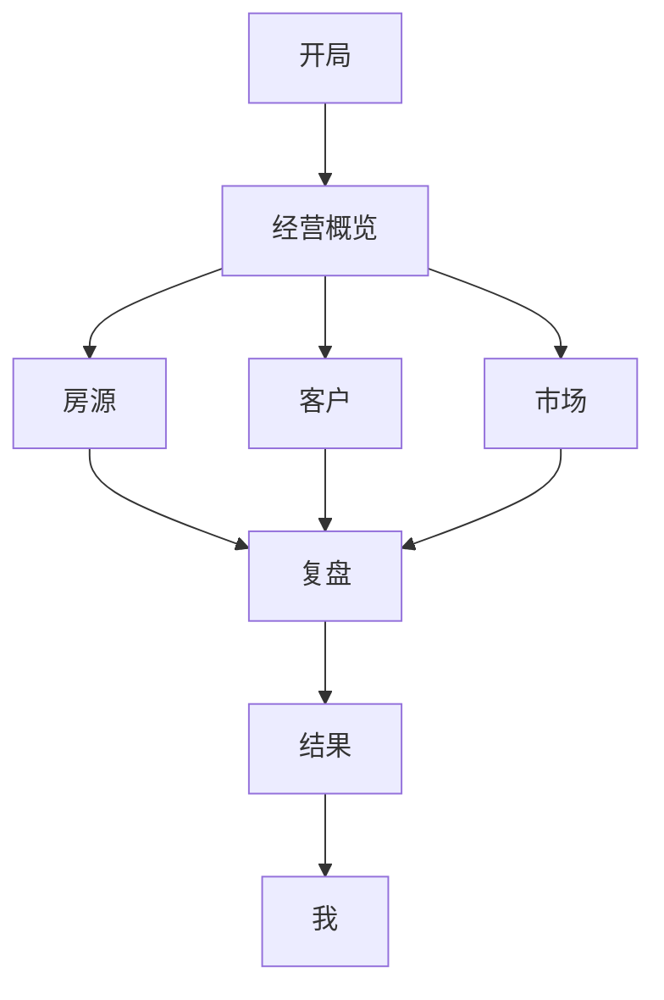

# 卖房（资产顾问）信息架构设计

最后更新：2026-04-21

这份文档回答的是：

> 玩家在一局里，应该先看到什么，再看到什么；每一层页面到底在承载什么信息；这些页面信息背后分别映射到底层哪些对象。

这份文档不回答：

- 某个组件像素怎么排
- 某个接口怎么命名
- 某个字段怎么存数据库

它只回答：

1. 信息怎么组织，玩家才容易判断
2. 页面上的每块信息，底层到底来自哪里
3. 哪些是世界真相，哪些只是投影

---

## 0. 一句话结论

这个游戏最稳的信息架构，不是按“数据类型”分页面，而是按“玩家每天要做的判断”来分。

所以信息架构建议收成 8 个一级区：

1. `开局`
2. `经营概览`
3. `房源`
4. `客户`
5. `市场`
6. `复盘`
7. `结果`
8. `我`

一句话理解：

- `开局` 决定这是一局什么牌
- `经营概览` 告诉你今天先救谁
- `房源` 是主战场
- `客户` 是推进池
- `市场` 是外部环境
- `复盘` 讲因果链
- `结果` 讲这一局最后值不值
- `我` 讲玩家自身状态、关系网络和长期战绩

其中“成交”要作为一条贯穿能力，而不是只放在结果页末尾。

因为它同时影响：

- 房源详情
- 客户详情
- 市场
- 昨日情报
- 复盘
- 结果

---

## 1. 设计原则

### 1.1 页面按判断分，不按表分

不要做成：

- 业主页
- 客户页
- 房源页
- 事件页

这种“数据库视角”结构。

玩家真正的问题不是“我要看哪个表”，而是：

- 今天先处理哪套房
- 这套房的问题到底在业主、客户还是价格
- 这批客户里谁值得推
- 是我没做好，还是商圈变了

所以页面应该围绕判断问题组织。

### 1.2 列表只负责定位，详情才负责决策

列表页不要装太多解释。

列表页只做三件事：

- 快速扫
- 快速排
- 快速进

真正的解释、因果、动作建议，都放在详情或侧栏里。

### 1.3 世界真相和页面解释必须分开

页面里可以出现：

- `适合谈价`
- `客户池偏薄`
- `建议本周做开放日`

但这些都只是 `Projection`。

底层真相仍然应该是：

- `OwnerCaseRelation.trust`
- `OwnerCaseRelation.patience`
- `CustomerCaseRelation.stage`
- `CaseRuntime.heat`
- `MarketState.weekendTrafficBoost`

### 1.4 房源页是主战场，其他页是辅助判断

这个游戏本质还是“多盘经营”。

所以：

- 房源页应该最强
- 客户页是推进辅助
- 市场页是环境辅助
- 复盘页是因果辅助

不要把它做成客户 CRM 主导。

### 1.5 首页和市场页不能互相代打

首页负责：

- 今天先处理谁
- 当前主房源是谁
- 今天外部有没有变化

市场页负责：

- 外部先变了哪一层
- 变化怎么一路传到房源
- 哪套房最先被外部压到

所以：

- 首页不能再展开完整市场解释
- 市场页不能再做“先处理哪件事”的工作台
- 两页之间必须形成“首页摘要 -> 市场解释 -> 房源决策”的顺序

### 1.6 同一类信息只允许一个页面做一级表达

页面一旦职责不清，就会出现：

- 首页和市场页都在讲外部变化
- 首页和房源页都在讲单房主矛盾
- 客户页和房源页都在重复同一条机会解释

所以要固定去重规则：

- 今日优先事项：
  - 一级表达：首页
  - 其他页面不再重复“今天先做什么”
- 外部变化总览：
  - 一级表达：首页只放短摘要
  - 深入表达：市场页
- 受影响房源排序：
  - 一级表达：市场页
  - 首页只允许在当前主房源块短提
- 单房决策事实链：
  - 一级表达：房源页
  - 首页只放短版入口
- 结果与长期战绩：
  - 单局结果：结果页
  - 长期沉淀：我 / 排行榜

一句话：

> 同一类信息只能有一个一级页面负责抬头讲清楚，其他页面只保留摘要、入口或回链。

---

## 2. 玩家玩的界面是什么样

先不要从数据库对象出发。

玩家真正面对的界面，应该是一个“经营工作台”。

建议整体形态是：

```text
顶部：局内状态条
  当前天数 / 周几 / 剩余天数 / 精力 / 推广金 / 当前目标 / Continue

左侧：一级导航
  经营概览 / 房源 / 客户 / 市场 / 复盘 / 结果 / 我

中间：当前页面主工作区
  列表、日历、雷达、详情主内容

右侧：洞察与行动侧栏
  当前提醒 / 建议事项 / 可做动作 / 影响预估

底部或抽屉：流水日志
  今天发生了什么 / 这套房发生了什么 / 这个客户发生了什么
```

一句话：

> 主工作区负责看局面，右侧侧栏负责下一步，流水日志负责追因果。

### 2.1 顶部状态条

顶部不做复杂分析。

只放玩家随时要知道的局内状态：

- 当前第几天
- 今天周几
- 距离结算还有几天
- 今日精力
- 推广金
- 当前难度
- 当前目标分 / 当前预估分

这些不是详情。
这些是“局内仪表”。

### 2.2 左侧一级导航

左侧导航不要放太多入口。

建议固定：

- `经营概览`
- `房源`
- `客户`
- `市场`
- `复盘`
- `结果`
- `我`

`开局` 只在局开始前出现。
进入局内后，开局入口可以退到“本局信息”里。

### 2.3 中间主工作区

中间区域永远回答一个问题：

> 当前这个页面上，玩家主要要做什么判断？

例如：

- 经营概览：今天先处理谁
- 房源：这套房怎么打
- 客户：哪个客户值得推
- 市场：外部环境哪里变了
- 复盘：这一局为什么赢/输

### 2.4 右侧洞察与行动侧栏

右侧侧栏建议跨页面复用。

它不放全量信息，只放：

- 当前选中对象的重点提醒
- 推荐 Matter
- 可做动作
- 不能做的原因
- 预计影响

比如选中一套房时，右侧显示：

- 主矛盾：价格卡住
- 建议事项：定价沟通
- 事实依据：同类盘 3 天内两次降价、客户二看后卡价格
- 预计影响：提升业主松价 readiness，但消耗关系耐心

### 2.5 流水日志入口

流水日志必须是全局能力，不是某个页面私有能力。

建议有三种入口：

1. 全局流水
   看这一局所有关键事件。
2. 对象流水
   看某套房、某个客户、某个 Matter 的事件。
3. 日历流水
   看某一天到底发生了什么。

---

## 3. 信息层级：一层、二层、三层、四层、详情

信息架构要明确层级。

我建议固定成 5 层：

```text
L1 一级导航
  -> L2 页面视图
    -> L3 分区 / 列表
      -> L4 卡片 / 行
        -> Detail 详情页 / 详情抽屉
```

每一层职责不同，不能混。

## 3.1 L1 一级导航

回答：

> 我现在在哪个经营场景里？

例如：

- 经营概览
- 房源
- 客户
- 市场
- 复盘
- 结果
- 我

这一层不解决细节。
它只解决入口。

## 3.2 L2 页面视图

回答：

> 这个场景下，我现在要做什么判断？

例如经营概览可以有：

- 本周日历视图
- 今日视图
- 昨日情报视图

房源可以有：

- 房源列表视图
- 核心盘视图
- 风险盘视图

市场可以有：

- 雷达
- 行情
- 竞对

结果可以有：

- 单房结局
- 总分三维
- 关键成交与丢盘
- 排行榜入口

我可以有：

- 本职状态
- 关系网络
- 复盘入口
- 战绩

## 3.3 L3 分区 / 列表

回答：

> 我应该看哪一组东西？

例如房源页的分区：

- 核心盘
- 高风险盘
- 客户池薄的盘
- 价格卡住的盘

客户页的分区：

- 后段机会
- 快流失客户
- 高匹配客户
- 比较负荷过高客户

## 3.4 L4 卡片 / 行

回答：

> 这一条是不是值得点进去？

卡片或行只放决策摘要，不放完整解释。

例如房源卡片放：

- 房源名
- 当前状态
- 主风险
- 后段机会数
- 建议下一步

客户机会卡片放：

- 客户昵称
- 对应房源
- 当前阶段
- 推进 readiness
- 停滞 / 流失风险

新闻卡片放：

- 标题
- 发生时间
- 影响范围
- 受影响房源数

## 3.5 Detail 详情页 / 详情抽屉

回答：

> 为什么是这样，我能做什么，证据在哪里？

详情页才放：

- 完整上下文
- 事实链
- 影响对象
- 相关 Matter
- 相关事件
- 推荐动作
- 历史流水

一句话：

> 列表负责定位，卡片负责吸引点击，详情负责解释和行动。

---

## 3.6 当前一级页面职责收口

这一节补当前阶段已经稳定下来的页面职责边界，避免实现继续漂。

### 经营概览

负责：

- 排今天顺序
- 抬出当前主房源
- 提醒今天外部有没有变化
- 告诉玩家昨天遗留是否影响今天

不负责：

- 完整市场拆解
- 单房完整事实链
- 结果复盘总结

### 房源

负责：

- 单套房怎么打
- 当前主矛盾在哪
- 业主、客户、价格、竞品分别卡在哪
- 当前能做什么动作

不负责：

- 全局今日排程
- 全市场总览

### 客户

负责：

- 哪些客户值得推
- 哪些客户快流失
- 当前阶段和推进阻力
- 从客户关系回到具体房源

不负责：

- 代替房源页做单房主决策

### 市场

负责：

- 外部先变了哪一层
- 当前证据是什么
- 变化怎么压到房源
- 哪些房源最先受影响

不负责：

- 今日工作台
- 今天先处理哪件事
- 完整昨日复盘

### 复盘

负责：

- 发生了什么
- 为什么会这样
- 哪些动作改变了结果

### 结果

负责：

- 这局最后打成什么样
- 哪些房源成交 / 丢盘 / 守住
- 三维分数与结果摘要

### 我

负责：

- 玩家自身状态
- 生涯表现
- 长期沉淀

---

## 3.7 首页与市场页的当前边界

首页回答：

- 今天先做什么
- 当前主房源是谁
- 今天有没有外部变化
- 昨天遗留是否影响今天

市场页回答：

- 外部哪里先变
- 变化强度和证据
- 变化怎么一路传下来
- 哪些房源最先被压到

一句话边界：

- 首页负责“排顺序”
- 市场页负责“讲外因”

---

## 4. 哪些东西必须有详情页

不是所有东西都要详情页。

判断标准是：

> 这个东西是否会被玩家反复查看、追溯、行动、复盘。

如果会，就要有详情。

## 4.1 必须有详情页的事实实体

### Case 房源详情

必须有。

因为房源是主战场。

房源详情要包含：

- 总览
- 业主
- 客户池
- 价格
- Matter
- 事件流水
- 复盘片段

### Customer 客户详情

必须有，但不要做成传统 CRM。

客户详情重点不是联系方式，而是：

- 客户画像
- 当前状态
- 你和他的关系
- 他和哪些房有机会
- 哪条机会最值得推
- 最近流水

### CustomerCaseRelation 机会详情

必须有。

这是客户和某套房的推进主线。

机会详情要包含：

- 当前阶段
- 进入方式
- 推进 readiness
- 停滞风险
- 流失风险
- 相关客户
- 相关房源
- 最近接触
- 下一步 Matter
- 阶段流水

### Owner 业主详情

建议有，但入口可以藏在房源详情里。

如果一个业主只对应一套房，先作为房源详情里的业主详情即可。

如果未来一个业主有多套房，再升级成独立业主页。

### Matter 事项详情

必须有。

因为 Matter 是玩法单位。

Matter 详情要包含：

- 模板类型
- 当前阶段
- 参与者
- 关联房源 / 客户 / 业主
- 已做动作
- 下一步动作
- 完成条件
- 失败风险
- 事件流水

### Matter 展示层级

Matter 不应该都用同一种详情形态。

建议固定三层：

1. `inline-card`
   在 `经营概览`、房源详情中段、客户详情里直接显示，点击后开抽屉或弹层。
2. `detail-page`
   有完整详情页，适合反复回来查看和推进。
3. `full-screen`
   独立专屏，适合开放日这类持续执行场景。

页面层的职责要定死：

- `经营概览`
  承接 Matter 的发现和分发
- `房源详情`
  承接与该房直接相关的 Matter 主战场
- `客户详情`
  承接跨房源客户推进 Matter
- `Matter 详情页`
  承接完整解释和推进
- `专屏`
  承接实时执行和统一结算

### 哪些 Matter 适合普通卡片

适合：

- 信息量小
- 决策步骤少
- 单次处理时间短
- 不需要持续盯着

例如：

- 客户回电
- 业主催反馈
- 带看前确认
- 开放日前提醒

### 哪些 Matter 适合独立页面

适合：

- 需要事实包
- 有 2-4 步推进
- 会反复回来查看
- 结果会影响后续一串动作

例如：

- 定价沟通
- 卡盘诊断
- 业主汇报
- 带看推进
- 联卖协商
- 合同 / 过户准备

### 哪些 Matter 适合专屏

适合：

- 有明确执行时段
- 有实时反馈
- 同时影响多对象
- 退出时需要统一结算

第一阶段建议只有：

- `open_house`

这是为了保证专屏是少数关键体验，不泛滥。

### Campaign 活动详情

必须有。

包括：

- 开放日
- 商圈活动
- 聚焦活动
- 联合推广

活动详情要包含：

- 时间
- 地点
- 参与房源
- 参与客户
- 报名状态
- 到访结果
- 影响总结
- 流水日志

### Market News 新闻详情

必须有。

因为新闻不是装饰，而是市场事件的玩家读法。

新闻详情要包含：

- 这条新闻说了什么
- 来源于哪些底层事件
- 影响哪个地区 / segment
- 影响哪些房
- 影响哪些客户 / 业主类型
- 对今天行动有什么提示

### WorldEvent 事件详情

必须有，但可以是详情抽屉。

事件是事实链最小单位。

事件详情要包含：

- 发生时间
- 事件类型
- 参与对象
- 发生地点
- 来源 Matter / 系统 / 市场
- 影响字段
- before / after
- 相关后续事件

### Market Scope 市场范围详情

建议有。

例如：

- 城市详情
- 区域详情
- 商圈详情
- 小区群详情
- segment 详情

它们回答：

- 这个范围现在冷热如何
- 最近发生什么
- 哪类房受影响
- 哪些竞品在动
- 哪些机会可借

### Organization / CoSale 组织和联卖详情

建议有。

包括：

- Brand
- ACN
- Store
- BizAreaManager
- CoSaleRelation

不一定每个都做完整大页，但至少要能点开看：

- 关系是什么
- 能借什么力
- 有什么风险
- 最近有什么动作

---

## 5. 哪些东西不应该有独立详情页

下面这些一般不需要独立详情页：

- 单个标签
- 单个分数
- 单个投影文案
- 单个建议动作按钮
- 单个资源数字

它们应该进入相关详情页，而不是自己开页面。

例如：

- “适合谈价”
  应进入房源详情的价格 / Matter 区。
- “客户池偏薄”
  应进入房源详情的客户池区。
- “竞品活跃”
  应进入市场或竞争详情。

---

## 6. 新闻、事件、事实实体、日志的关系

这四个概念必须分清。

```text
事实实体 Entity
  世界里的对象，比如房、客户、业主、Matter、活动

事件 Event
  某个时间点发生的事实

新闻 News
  给玩家读的一组事件摘要

流水日志 Log
  按时间串起来的事件记录
```

## 6.1 新闻不是事件

新闻是投影。

例如：

> 昨天同类盘开始集中降价。

它背后可能来自多条事件：

- A 房降价
- B 房降价
- C 房挂牌价下调
- 某 segment pricePressure 上升

所以新闻详情必须能展开到事件。

## 6.2 事件不是日志

事件是单个事实。

日志是事件的排列。

例如：

- `customer.showing.completed`
  是事件
- 这个客户最近 7 天的所有事件
  是日志

## 6.3 事实实体不是投影

事实实体是世界真相。

例如：

- `Case`
- `Owner`
- `Customer`
- `Matter`

但：

- “高风险盘”
- “适合谈价”
- “今天优先”

这些都是投影。

---

## 7. 流水日志必须怎么设计

流水日志不是一个普通列表。

它是复盘、解释、信任感的底座。

## 7.1 必须有全局流水

全局流水回答：

> 这一局从开始到现在发生过什么。

它至少包括：

- 市场事件
- 玩家动作
- Matter 阶段变化
- 客户机会变化
- 业主状态变化
- 价格变化
- 竞品 / 联卖事件

## 7.2 必须有对象流水

对象流水回答：

> 这个对象为什么变成现在这样。

对象可以是：

- 一套房
- 一个客户
- 一条机会
- 一个 Matter
- 一个活动
- 一个市场范围

## 7.3 必须有日流水

日流水回答：

> 某一天到底发生了什么。

它应该能从经营概览日历里点开。

### 日流水结构

```text
某一天详情
  今日市场新闻
  今日完成事项
  今日机会变化
  今日业主变化
  今日价格变化
  今日风险提醒
  全部事件列表
```

## 7.4 日志每条至少显示什么

```ts
type LogItemProjection = {
  id: string;
  happenedAtDay: number;
  happenedAtLabel: string;
  eventType: string;
  title: string;
  summary: string;
  severity?: 'info' | 'warning' | 'critical';
  relatedEntityRefs: EntityRef[];
  sourceType: 'player-action' | 'matter' | 'market' | 'system' | 'rival';
  canOpenDetail: boolean;
};
```

## 7.5 日志要支持过滤

至少支持：

- 只看市场
- 只看房源
- 只看客户
- 只看业主
- 只看 Matter
- 只看风险
- 只看玩家动作

---

## 8. 详情页的标准结构

所有详情页建议遵守同一个骨架。

```text
详情页 / 详情抽屉
  1. 标题区
  2. 当前摘要
  3. 关键指标
  4. 事实链 / 时间线
  5. 影响对象
  6. 可做动作 / 下一步 Matter
  7. 关联对象
```

## 8.1 标题区

回答：

- 这是什么
- 当前状态是什么
- 重要程度如何

## 8.2 当前摘要

回答：

- 现在最重要的一句话是什么

## 8.3 关键指标

只放和判断直接相关的指标。

不要把所有字段都倒出来。

## 8.4 事实链 / 时间线

详情页必须能解释：

> 为什么现在是这个状态。

## 8.5 影响对象

例如新闻详情要显示：

- 影响哪些房
- 影响哪些客户
- 影响哪些业主
- 影响哪些 Matter

## 8.6 可做动作 / 下一步 Matter

详情页不是只读。

能行动的对象，应该能直接开 Matter 或推进 Matter。

## 8.7 关联对象

每个详情页都要能跳到相关对象。

例如：

- 事件 -> 房源
- 事件 -> 客户
- Matter -> 业主
- 新闻 -> 市场范围
- 机会 -> 客户和房源

---

## 9. 一层到详情的例子

### 9.1 从经营概览进入新闻详情

```text
L1 经营概览
  -> L2 本周日历
    -> L3 今日新闻
      -> L4 新闻卡片：同类盘集中降价
        -> Detail 新闻详情
          -> 底层事件列表
          -> 受影响房源
          -> 建议动作
```

### 9.2 从房源进入机会详情

```text
L1 房源
  -> L2 房源列表
    -> L3 核心盘分组
      -> L4 A 房卡片
        -> Detail 房源详情
          -> 客户池
            -> Opportunity Detail
```

### 9.3 从市场进入商圈详情

```text
L1 市场
  -> L2 全局雷达
    -> L3 区域下钻
      -> L4 某商圈卡片
        -> Detail 商圈详情
          -> 竞品动静
          -> 同类盘压力
          -> 相关房源
```
```

### 9.4 从 Matter 进入事件流水

```text
L1 房源
  -> L2 房源详情
    -> L3 动作 / 事项
      -> L4 Matter 卡片
        -> Detail Matter 详情
          -> Matter 流水
          -> 相关事件详情
```

---

## 10. 信息架构的硬规则

1. 一级导航不超过 8 个。
2. 经营概览是默认入口。
3. 房源是主战场。
4. 客户是推进辅助，不是 CRM 后台。
5. 市场从全局到局部，不是只看商圈。
6. 新闻必须能展开到底层事件。
7. 事件必须能回到相关实体。
8. 事实实体详情必须有流水。
9. Projection 文案不能当世界字段。
10. 能行动的详情页，必须能开 Matter 或推进 Matter。

---

## 11. 一级信息架构

建议一级导航如下：

```text
开局
经营概览
房源
客户
市场
复盘
结果
我
```

也可以画成：



---

## 12. 页面结构和底层映射

下面按页面讲。

每一页都回答 4 个问题：

1. 玩家来这页是为了解决什么判断
2. 页面应该显示什么
3. 底层映射到哪些对象
4. 哪些内容必须是投影

---

## 12.1 开局

### 玩家在这里解决什么问题

- 打哪一档难度
- 打标准局还是随机局
- 这局大概是什么压力
- 我现在想练什么

### 页面应该显示什么

- 六档难度卡片
- 每档难度气质说明
- 默认推荐标准局
- 随机局入口
- 预估房源数 / 天数 / 压力标签

### 底层映射

| 页面块 | 底层对象 |
| ---- | ---- |
| 难度卡片 | `DifficultyTier` |
| 难度说明 | `DifficultyTier.description` + `DifficultyProfile` |
| 标准局入口 | `ScenarioBlueprint` / `ScenarioCatalog` |
| 随机局入口 | `ScenarioGenerationRequest` |
| 压力标签 | `DifficultyProfile` 的旋钮摘要 |

### 这里哪些是投影

- “顺手 / 拉扯 / 高压 / 极限”
- “适合熟手感 / 适合练判断”
- “这局更吃资源排序”

这些都是对难度画像的说明，不是底层运行字段。

---

## 12.2 经营概览

### 玩家在这里解决什么问题

- 这一周每天大概有什么事
- 今天有没有重要新闻、事项、提醒
- 哪天比较忙，哪天适合做重动作
- 有没有快到期、快流失、快见面的关键点

### 页面应该显示什么

- 一周日历
- 每天的新闻
- 每天的事项
- 每天的提醒
- 今天资源状态
- 本周重点节点

### 底层映射

| 页面块 | 底层对象 |
| ---- | ---- |
| 一周日历 | `World.TimeContext` + `Matter[]` + `WorldEvent[]` |
| 每天的新闻 | `WorldEvent[]` + `MarketRadarProjection` |
| 每天的事项 | `Matter[]` |
| 每天的提醒 | `ReminderProjection` + `ActionReadinessProjection` |
| 今天资源状态 | `BrokerRuntimeState` + `World.TimeContext` |
| 本周重点节点 | `RunDifficultyConfig` + `Matter[]` + `CustomerCaseRelation[]` + `OwnerCaseRelation[]` |

### 页面建议结构

```text
经营概览
  顶部：本周一周日历
  右侧 / 下方：今日资源状态
  底部：本周重点节点
```

### 一周日历里放什么

每一天只挂 3 类东西：

- `新闻`
  市场或竞品的重要变化
- `事项`
  已安排、进行中、即将发生的事
- `提醒`
  快到期、快流失、该跟进、该见面

建议视觉上做成：

- 新闻：信息型
- 事项：行动型
- 提醒：风险型

### 新闻、事项、提醒的底层映射

| 日历元素 | 底层对象 |
| ---- | ---- |
| 新闻 | `WorldEvent` 中的市场、竞品、区域变化事件 |
| 事项 | `Matter` |
| 提醒 | `OwnerCaseRelation`、`CustomerCaseRelation`、`ActionReadinessProjection` 生成的提醒 |

### 本周重点节点建议显示什么

- 周末开放日窗口
- 重点客户见面 / 出价窗口
- 某套房耐心临界点
- 某事项截止日
- 高成本动作更适合的日子

### 这里哪些是投影

- 日历上的提醒标签
- 新闻摘要文案
- “今天偏忙 / 今天适合做重动作”
- “本周三前最好处理 A 盘”
- “本周末更适合打开放日”

### 这一页不该直接暴露的东西

- 全量客户明细
- 全量底层事件 payload
- 所有关系原始字段

这里应该给的是“周节奏视图”，不是后台控制台。

---

## 12.3 房源

这是主战场。

### 玩家在这里解决什么问题

- 这套房到底值不值得继续打
- 问题主要在房、业主、客户、价格还是外部市场
- 现在先做什么事项

### 页面建议结构

```text
房源页
  左栏：房源列表
  主区：房源详情
    总览
    业主
    客户池
    价格
    动作 / 事项
    动静 / 时间线
```

### 左栏：房源列表

#### 显示什么

- 标题
- 当前状态
- 风险标签
- 热度
- 后段机会数
- 业主关系状态

#### 底层映射

| 列表字段 | 底层对象 |
| ---- | ---- |
| 标题 / 小区 / 板块 | `CaseProfile` |
| 当前状态 | `CaseRuntime` + `OwnerCaseRelation` + `CustomerCaseRelation` 的聚合 |
| 风险标签 | `CaseDetailProjection` |
| 热度 | `CaseRuntime.heat` |
| 后段机会数 | `CustomerCaseRelation[]` 聚合 |
| 业主关系状态 | `BrokerOwnerRelation` + `OwnerCaseRelation` |

#### 这里哪些是投影

- 风险标签
- 当前状态文案
- “值得押 / 可放 / 危险”

### 主区：房源详情

#### A. 总览

回答：

- 这套盘是谁
- 当前盘面如何
- 主矛盾是什么

底层映射：

| 信息 | 底层对象 |
| ---- | ---- |
| 房子资料 | `CaseProfile` |
| 热度 / 曝光 / 竞争压力 | `CaseRuntime` |
| 好房分 / D1 D2 D3 | `GoodHouseModelOutput` |
| 当前主矛盾 | `CaseDetailProjection` |
| 结局方向感 | `CaseLifecycleProjection` |

#### B. 业主

回答：

- 这个业主是什么人
- 现在关系稳不稳
- 能不能谈价 / 推开放日 / 继续压

底层映射：

| 信息 | 底层对象 |
| ---- | ---- |
| 出售动机 / 性格 | `OwnerProfile` |
| 当前情绪 / 焦虑 / 市场理解 | `OwnerRuntimeState` |
| 你和他的关系 | `BrokerOwnerRelation` |
| 他对这套房的耐心 / 松价 / 配合度 | `OwnerCaseRelation` |
| 是否适合某类动作 | `ActionReadinessProjection` |

#### C. 客户池

回答：

- 这套房有没有池子
- 现在是不是缺后段机会
- 该补量还是补质量

这里必须拆成两层：

- 没见过面的客户，代表潜力和预估体量。
- 见过面的客户，才进入实名机会和详细阶段管理。

也就是说，房源页可以告诉玩家“这套房大概还有多少潜在买家”，但不能把没见过面的人伪装成一条条真实机会。

底层映射：

| 信息 | 底层对象 |
| ---- | ---- |
| 未见面潜力池 | `PlatformMatchOutput` / `CustomerProfile` 聚合 / `MarketState` |
| 预估潜在人群体量 | `CasePotentialPoolProjection` |
| 高匹配人群体量 | `CasePotentialPoolProjection` |
| 已见面实名机会 | `CustomerCaseRelation[]` |
| 后段机会数 | `CustomerCaseRelation[]` 聚合 |
| 看房后机会数 | `CustomerCaseRelation[]` 聚合 |
| 快流失机会 | `CustomerCaseRelation[]` 聚合 |
| 客户池厚薄判断 | `CustomerPoolProjection` |

页面表达建议：

```text
客户池
  潜力池：预估 160 人，高匹配 28 人，本周新增 12 人
  主力画像：刚需两房 / 预算 650-750
  已见面机会：后段 2，看房后 4，快流失 1
```

#### D. 价格

回答：

- 现在贵不贵
- 业主心理价和市场估价差多少
- 是不是已经卡住推进

底层映射：

| 信息 | 底层对象 |
| ---- | ---- |
| 挂牌价 | `CaseRuntime` / `OwnerCaseRelation` |
| 市场估价 | `PriceModelOutput.marketEstimatedPrice` |
| 心理价 | `PriceModelOutput.ownerPsychPrice` |
| 成交可行度 | `PriceModelOutput.dealFeasibility` |
| 谈价 readiness | `ActionReadinessProjection` |

#### E. 动作 / 事项

回答：

- 现在最适合做什么
- 这件事卡在哪
- 做完大概会影响哪一层

底层映射：

| 信息 | 底层对象 |
| ---- | ---- |
| 建议动作 | `ActionReadinessProjection` |
| 全部动作 | `ActionCatalog` + `ActionAvailabilityProjection` |
| 进行中的事项 | `Matter[]` |
| 最近事项结果 | `EventStore` |

#### F. 动静 / 时间线

回答：

- 这套房最近到底发生了什么
- 为什么今天变成这样

底层映射：

| 信息 | 底层对象 |
| ---- | ---- |
| 最近事项 | `Matter[]` |
| 最近事件 | `EventStore` |
| 关键转折 | `CaseTimelineProjection` |

---

## 12.4 客户

### 玩家在这里解决什么问题

- 哪些客户值得优先推
- 哪些机会在后段
- 哪些机会快流失
- 哪些客户在比较别的房

### 页面建议结构

```text
客户页
  左栏：客户/机会列表
  主区：机会详情
    客户画像
    当前阶段
    对比候选
    推进阻塞
    下一步事项
```

### 底层映射

| 页面块 | 底层对象 |
| ---- | ---- |
| 客户画像 | `CustomerProfile` |
| 客户当前状态 | `CustomerRuntimeState` |
| 客户与你的关系 | `BrokerCustomerRelation` |
| 该客户对某套房的推进 | `CustomerCaseRelation` |
| 比较列表 | 多条 `CustomerCaseRelation` |
| 值得先推谁 | `CustomerPoolProjection` / `ActionReadinessProjection` |

### 这里哪些是投影

- “高质量客户”
- “快流失”
- “更值得推 B 房而不是 A 房”
- “这条关系已经进入后段”

### 这一页要注意的边界

客户页不应该变成传统 CRM。

它不是为了展示“所有联系人”，而是为了回答：

> 哪些关系最值得推进，推进到哪一步了。

所以这里的主单位，应该是：

- `客户`
  和
- `客户 x 房源关系`

两层一起看。

---

## 12.5 市场

### 玩家在这里解决什么问题

- 最近是我没做好，还是市场真的变了
- 哪类房最近更卷
- 外部竞品和联卖在怎么动
- 这波市场变化对我哪几套盘影响最大

### 页面应该显示什么

- 昨日市场情报
- 雷达总览
- 按层级下钻
- 热门区域 / 冷却区域
- 同类盘竞争压力
- 外部门店动态
- ACN / 品牌网络可借力点

### 页面建议结构

```text
市场
  昨日市场情报
  全局雷达总览
  城市 -> 区域 -> 商圈 -> 板块 / segment 下钻
  区域热力
  竞品动静
  联卖 / 组织借力
```

### A. 昨日市场情报

回答：

- 昨天整个市场里最值得知道的 3-5 件事是什么
- 哪些变化会直接影响我今天的判断

建议显示：

- 昨日成交
- 昨日降价
- 昨日新增竞品
- 昨日区域热度变化
- 昨日风险信号

底层映射：

| 信息 | 底层对象 |
| ---- | ---- |
| 昨日成交 | `WorldEvent` + `Case` + `Brand` + `MarketState` |
| 昨日降价 | `WorldEvent` + `PriceModelOutput` + `MarketState` |
| 昨日新增竞品 | `WorldEvent` + `Rival` + `MarketState` |
| 昨日区域热度变化 | `WorldEvent` + `MarketState` + `MarketModelOutput` |
| 昨日风险信号 | `MarketRadarProjection` |

这里哪些是投影：

- “昨天同类盘开始明显降价”
- “昨天朝阳区成交抬头”
- “昨天竞品开始抢你这类客户”

### B. 雷达总览

回答：

- 当前整个市场最值得盯的变化是什么
- 这些变化对哪类盘影响最大

建议显示成雷达式 5 轴：

- 需求热度
- 供给压力
- 竞品活跃
- 客户活跃
- 联卖机会

底层映射：

| 轴 | 底层对象 |
| ---- | ---- |
| 需求热度 | `MarketState.demandIndex` |
| 供给压力 | `MarketState.supplyPressure` |
| 竞品活跃 | `RivalActivityProjection` + `WorldEvent` |
| 客户活跃 | `CustomerRuntimeState` 聚合 + `CustomerCaseRelation` 聚合 |
| 联卖机会 | `ACN` + `CoSaleRelation` + `OrganizationProjection` |

这里哪些是投影：

- 雷达 5 轴分数本身
- “本周市场偏卷”
- “联卖机会高于平时”

### C. 按层级下钻

市场信息不应该一上来只看商圈。

建议固定按大到小 5 层拆：

1. `city`
2. `district`
3. `bizArea`
4. `community / cluster`
5. `segment`

这里的 `segment` 不是地理层，而是房型 / 总价带 / 客群细分层。

也就是说，市场其实是两条并行维度：

- 地理维度：
  城市 -> 区域 -> 商圈 -> 小区群
- 产品维度：
  总价带 / 户型段 / 客群段

回答：

- 变化发生在哪一层
- 是区域问题，还是某类房的问题
- 哪一层最先开始变

底层映射：

| 层级 | 底层对象 |
| ---- | ---- |
| city | `MarketState.city` + macro events |
| district | `MarketState.districtDemandIndex` + district events |
| bizArea | `MarketState.bizAreaFlow` + bizArea events |
| community / cluster | `CaseRuntime` 聚合 + `CompetitionModelOutput` |
| segment | `MarketState.segmentLiquidity` + segment events |

### D. 区域热力

回答：

- 哪些区域 / 商圈在升温
- 哪些区域 / 商圈在转冷
- 哪类房受影响最大

底层映射：

| 页面块 | 底层对象 |
| ---- | ---- |
| 区域 / 商圈热度 | `MarketModelOutput` |
| 冷热变化 | `WorldEvent` + `MarketState` |
| 哪类房受影响 | `CaseRuntime` + `GoodHouseModelOutput` + `MarketImpactProjection` |

### E. 竞品动静

回答：

- 昨天和最近一周，竞品在怎么动
- 是谁在抢盘、抢客、抢注意力

底层映射：

| 页面块 | 底层对象 |
| ---- | ---- |
| 外部门店动态 | `Organization` + `Rival` + `WorldEvent` |
| 同类盘竞争压力 | `CaseRuntime` + `CompetitionModelOutput` |
| 抢盘 / 抢客信号 | `WorldEvent` + `Brand` + `CoSaleRelation` |

### F. 联卖 / 组织借力

回答：

- 现在有哪些联卖机会
- 哪些组织网络可以借

底层映射：

| 页面块 | 底层对象 |
| ---- | ---- |
| 联卖借力点 | `ACN` + `CoSaleRelation` + `OrganizationProjection` |
| 品牌支持 / 门店支持 | `Brand` + `Store` + `BizAreaManager` |
| 组织侧风险 | `OrganizationProjection` + `WorldEvent` |

### 这里哪些是投影

- “这周商圈转冷”
- “昨天朝阳东部流量抬升”
- “海淀西北改善盘更卷了”
- “这类盘更卷了”
- “周末流量窗口适合打开放日”
- “同 ACN 内这套房更容易借力”
- “昨天最大的变化来自某个区域层级”

---

## 12.6 复盘

### 玩家在这里解决什么问题

- 这局为什么赢 / 输
- 哪一步是转折点
- 哪类动作最值钱
- 我浪费了什么资源

### 页面应该显示什么

- 关键转折时间线
- 房源结果总览
- 资源使用情况
- 关键事项链
- 失败原因 / 成功原因

### 底层映射

| 页面块 | 底层对象 |
| ---- | ---- |
| 关键转折 | `EventStore` + `Matter[]` |
| 房源结果总览 | `RunResult` + `CaseEndingProjection` |
| 资源消耗 | `BrokerRuntimeState` + `BudgetLedger` + `Matter[]` |
| 关键事项链 | `Matter[] -> Event[]` |
| 成败归因 | `ReviewProjection` |

### 这里哪些是投影

- “输在太贪”
- “押对了 A 盘”
- “推广投放有效，但承接没跟上”
- “其实不是关系问题，是价格窗口没打开”

这些都是系统对事实链的解释。

---

## 12.7 结果

### 玩家在这里解决什么问题

- 这局最后算不算好
- 各套房落成了什么样
- 我在同难度里是什么水平

### 页面应该显示什么

- 单房结局
- 总分
- 三维得分
- 关键成交与丢盘
- 本局摘要
- 榜单位置

### 底层映射

| 页面块 | 底层对象 |
| ---- | ---- |
| 总分 / 三维得分 | `SettlementEngine` -> `RunResult` |
| 单房结局 | `CaseEndingProjection` |
| 关键成交与丢盘 | `ClosedDealRecord[]` + `DealStatsProjection` |
| 本局摘要 | `ResultProjection` |
| 榜单位置 | `LeaderboardEntry` + `LeaderboardProjection` |
| 难度解释 | `DifficultyTier` + `RunDifficultyConfig` + `ResultProjection` |

### 这里哪些是投影

- “这局属于高压下的优秀守盘局”
- “虽然成交不多，但守盘做得很好”
- “在该难度下，这是很强的一局”

结果页的展示顺序建议是：

1. 单房结局卡
2. 总分与三维
3. 关键成交与丢盘
4. 本局摘要
5. 排行榜入口

原因是玩家更关心“这一单做成什么样”，总分更多用于段位、解锁和排行榜。

---

## 12.8 我

### 玩家在这里解决什么问题

- 我这个经纪人当前状态如何
- 我的关系网络如何
- 我历史表现如何
- 我从哪里回看本周、本月复盘

### 页面应该显示什么

- 本职状态
- 关系网络
- 复盘入口
- 战绩

### 底层映射

| 页面块 | 底层对象 |
| ---- | ---- |
| 本职状态 | `BrokerRuntimeState` + `PlayerProfile` |
| 关系网络 | `BrokerOwnerRelation` + `BrokerCustomerRelation` + `CoSaleRelation` |
| 复盘入口 | `DailyRunSnapshot[]` + `ReviewProjection` |
| 战绩 | `RunResult` + `PlayerCareerStats` + `LeaderboardEntry` |

### 这里哪些是投影

- “当前压力偏高”
- “你这局更像守盘型打法”
- “本周关系修复做得不错”

---

## 13. 底层对象到页面的总映射

这个表更适合开发时看。

| 底层对象 | 最主要出现在哪 |
| ---- | ---- |
| `Account / PlayerProfile / PlayerCareerStats / LeaderboardEntry` | 结果 / 我 |
| `DifficultyTier / DifficultyProfile / RunDifficultyConfig` | 开局、结果 |
| `GameRun / RunResult / RunSession` | 开局、复盘、结果 |
| `CaseProfile / CaseRuntime` | 房源、经营概览 |
| `OwnerProfile / OwnerRuntimeState` | 房源详情 |
| `CustomerProfile / CustomerRuntimeState` | 客户、房源详情 |
| `BrokerRuntimeState` | 经营概览、复盘 |
| `OwnerCaseRelation` | 房源详情 |
| `BrokerOwnerRelation` | 房源详情 |
| `BrokerCustomerRelation` | 客户详情 |
| `CustomerCaseRelation` | 客户、房源详情、经营概览 |
| `Matter` | 房源、客户、复盘 |
| `EventStore` | 经营概览、房源时间线、复盘 |
| `MarketState / MarketModelOutput` | 市场、经营概览 |
| `PriceModelOutput` | 房源价格区 |
| `GoodHouseModelOutput` | 房源总览、经营概览 |

---

## 14. 页面层哪些是“直接事实”，哪些是“投影”

### 5.1 可以直接显示事实的

- 标题、小区、板块
- 热度、曝光、竞争压力
- 当前挂牌价
- 当前阶段
- 当前正在进行的 Matter
- 已发生的 Event 时间线
- 精力、预算、剩余天数

### 5.2 更适合显示投影的

- 当前主矛盾
- 值不值得继续押
- 适合谈价还是先稳关系
- 客户池偏薄还是后段不足
- 市场是真的转冷还是你自己掉节奏
- 这局输赢的原因

---

## 15. 最后一句设计原则

以后如果要加新页面、新卡片、新标签，只问 3 句：

1. 玩家来这里，是为了做什么判断？
2. 这块展示的是事实，还是对事实的解释？
3. 如果把这块删掉，玩家会不会更难做出正确顺序？

如果它只是解释、排序、建议、标签、摘要，那大概率它应该是 `Projection`。
如果它是世界里的真实状态，那就应该回到底层对象里。
