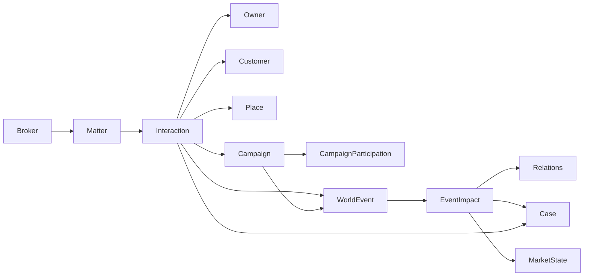

# 卖房（资产顾问）交互、活动、事件架构

最后更新：2026-04-21

这份文档回答的是：

> 经纪人的动作到底是在和谁交互；商圈和小区的活动怎么建模；事件要不要带地点、人物、影响；背后的底层架构应该怎么接。

这份文档不回答：

- 某个按钮怎么命名
- 某个接口路径怎么写
- 某张表最终叫 `campaigns` 还是 `market_campaigns`

它只回答：

1. 这几个概念在领域里分别是什么
2. 它们之间怎么连
3. 典型业务链路怎么走

---

## 0. 一句话结论

这块最稳的结构是：

- `Actor`
  人物
- `Place`
  地点
- `Interaction`
  一次具体交互
- `Campaign`
  一次公共活动
- `Participation`
  谁/哪套房参与了这个活动
- `WorldEvent`
  已经发生的事实
- `EventImpact`
  这个事实影响了谁的什么状态

一句话链路：

> 经纪人在某个地点，和某些对象发起一次交互；交互可能挂在某个活动上；交互或活动完成后产出事件；事件再去改关系、房源、市场和活动参与状态。

---

## 1. 为什么要把这几个对象分开

如果不分开，后面会很乱：

- 经纪人动作会被做成一堆抽象按钮
- 周末开放会被误建成“房源自己的动作”
- 事件会只剩文案日志，没有地点和影响
- 聚焦资源会混成“房子突然热度加 20”

这几个东西本质上不是一回事：

- 动作是人为发起的交互
- 活动是公共窗口
- 事件是已经发生的事实
- 影响是事实对状态的改变

所以一定要拆。

---

## 2. 经纪人的动作，是和谁交互

经纪人的动作，本质上只会和这几类对象交互：

- `Owner`
  业主
- `Customer`
  客户
- `Case`
  房源
- `Broker`
  其他经纪人
- `BizAreaManager`
  商圈经理 / 店经理
- `Campaign`
  商圈活动 / 小区活动 / 聚焦活动
- `Platform`
  平台能力，比如申请聚焦、报名活动、查看情报

所以经纪人的动作，不要设计成：

- `doAction('open_day')`
- `doAction('visit')`

而应该设计成：

> `Broker` 对某个对象，在某个地点，发起一次 `Interaction`

---

## 3. Interaction：一次交互

### 3.1 一句话定义

`Interaction` 是：

> 某个发起者，在某个地点，围绕某个目标，和若干对象发生的一次具体交互。

它比 `Matter` 更细。

关系可以这样理解：

- `Matter`
  是玩家视角里的“这件事”
- `Interaction`
  是这件事里具体发生的一次交互

有时一条 Matter 只有一次 Interaction。
有时一条 Matter 里会有多次 Interaction。

### 3.2 建议字段

```ts
type Interaction = {
  id: string;
  type:
    | 'owner-meeting'
    | 'owner-followup'
    | 'customer-showing'
    | 'customer-followup'
    | 'price-negotiation'
    | 'campaign-invite'
    | 'campaign-application'
    | 'focus-application'
    | 'co-sale-sync'
    | 'manager-review';
  initiatorActorId: string;
  participantActorIds: string[];
  caseIds?: string[];
  placeId: string;
  stage: 'planned' | 'ongoing' | 'done' | 'cancelled';
  relatedMatterId?: string;
  relatedCampaignId?: string;
  relatedRelationIds?: string[];
  intent?: string;
  outcome?: Record<string, unknown>;
};
```

### 3.3 常见例子

- 经纪人约业主面谈
- 经纪人带客户看房
- 经纪人邀请业主报名小区开放日
- 经纪人向经理申请聚焦
- 经纪人和同 ACN 经纪人做联卖同步

---

## 4. Place：地点

地点不能只是字符串。

因为：

- 活动有范围
- 事件有地点
- 客户带看发生在某地
- 市场信息有层级

### 4.1 建议字段

```ts
type Place = {
  id: string;
  level: 'city' | 'district' | 'bizArea' | 'community' | 'listing' | 'store';
  name: string;
  parentPlaceId?: string;
  tags?: string[];
};
```

### 4.2 能表达什么

- 北京
- 朝阳
- 望京
- 某小区
- 某套房
- 某门店

### 4.3 为什么重要

因为后面这些都要带地点：

- 市场事件
- 商圈活动
- 小区开放日
- 客户带看
- 经理评审
- 联卖协同

---

## 5. Campaign：公共活动

### 5.1 一句话定义

`Campaign` 是：

> 在某个地点、某个时间窗内，由组织或平台开放的一类公共活动。

它不是某个房源自带动作。

### 5.2 建议字段

```ts
type Campaign = {
  id: string;
  type:
    | 'bizarea-open-house'
    | 'community-open-day'
    | 'focus-allocation'
    | 'joint-promotion'
    | 'manager-focus-review';
  scope: {
    level: 'city' | 'district' | 'bizArea' | 'community';
    placeId: string;
  };
  startAt: string;
  endAt: string;
  organizerActorId?: string;
  rules: Record<string, unknown>;
  state: 'planned' | 'open' | 'closed' | 'settled';
};
```

### 5.3 典型活动

- 商圈周末开放日
- 小区周末开放窗口
- 一轮焦点位分配
- 一轮联合推广
- 商圈经理组织的重点盘评审

---

## 6. Participation：谁参与了活动

### 6.1 一句话定义

`Participation` 是：

> 某个人、某套房、某个经纪人是否参与了某个活动。

### 6.2 建议字段

```ts
type CampaignParticipation = {
  id: string;
  campaignId: string;
  subjectType: 'case' | 'owner' | 'broker' | 'customer';
  subjectId: string;
  status:
    | 'invited'
    | 'applied'
    | 'accepted'
    | 'rejected'
    | 'approved'
    | 'joined'
    | 'missed';
  appliedByActorId?: string;
  decidedByActorId?: string;
  notes?: string[];
};
```

### 6.3 为什么不能省

因为“活动开了”和“这套房参加了”不是一回事。

比如：

- 小区周末开放开了
- 经纪人邀请业主报名
- 业主不信任，不愿意参加
- 另一套房参加了

这些都必须分开表达。

---

## 7. Event：事实流

事件不是过程。
事件是已经发生的事实。

### 7.1 建议字段

```ts
type WorldEvent = {
  id: string;
  kind: string;
  happenedAt: string;
  placeId: string;
  actorIds: string[];
  subjectIds: string[];
  sourceType: 'interaction' | 'campaign' | 'market' | 'system';
  sourceId?: string;
  impacts: EventImpact[];
  payload: Record<string, unknown>;
};
```

### 7.2 EventImpact

```ts
type EventImpact = {
  targetType:
    | 'ownerCaseRelation'
    | 'brokerOwnerRelation'
    | 'brokerCustomerRelation'
    | 'customerCaseRelation'
    | 'caseRuntime'
    | 'customerRuntime'
    | 'campaignParticipation'
    | 'marketState';
  targetId: string;
  field: string;
  delta?: number;
  nextValue?: unknown;
  reason?: string;
};
```

### 7.3 为什么事件必须带地点、人物、影响

因为后面复盘和判断都要问：

- 谁做的
- 在哪发生的
- 影响了谁
- 影响了什么

如果没有这 4 个要素，事件就只是日志。

---

## 8. 四类东西的边界

### 8.1 客户和房源的推进

这属于：

- `CustomerCaseRelation`

比如：

- 咨询
- 有意向
- 预约首看
- 看房
- 二看
- 见面
- 出价
- 停滞
- 流失

注意：

- `成交` 不是 `CustomerCaseRelation` 的 canonical 阶段
- 正式成交应由 `DealClosingEvaluation` / `ClosedDealRecord` 产出

### 8.2 经纪人做的事

这属于：

- `Matter`
- `Interaction`

比如：

- 面访业主
- 邀约客户
- 安排带看
- 邀请报名开放日
- 申请聚焦

### 8.3 公共活动

这属于：

- `Campaign`
- `CampaignParticipation`

比如：

- 小区开放日
- 商圈开放周
- 焦点位分配

### 8.4 已发生的事实

这属于：

- `WorldEvent`

比如：

- 业主同意参加开放日
- 小区周末流量上升
- 某房源进入焦点位
- 客户完成看房

---

## 9. 典型链路

下面用 4 条链路把架构落地。

---

## 9.1 面访业主

### 业务过程

1. 经纪人约业主面谈
2. 在某地点见面
3. 沟通价格、反馈、策略
4. 业主情绪、信任、松价意愿发生变化

### 架构链路

```text
Matter(report / negotiate)
  -> Interaction(owner-meeting)
  -> WorldEvent(owner.meeting.completed)
  -> impacts:
       BrokerOwnerRelation
       OwnerCaseRelation
```

### 典型事件

- `owner.meeting.completed`
- `owner.trust.gain`
- `owner.patience.loss`
- `owner.price-flexibility.up`

---

## 9.2 带客户看房

### 业务过程

1. 经纪人联系客户
2. 安排看房
3. 在房源地点发生带看
4. 客户反馈更新
5. 推进或停滞

### 架构链路

```text
Matter(execute)
  -> Interaction(customer-showing)
  -> WorldEvent(showing.completed)
  -> impacts:
       BrokerCustomerRelation
       CustomerCaseRelation
       CaseRuntime
```

### 典型事件

- `showing.scheduled`
- `showing.completed`
- `customer.intent.up`
- `customer.compare.shift`
- `opportunity.advanced`

---

## 9.3 申请聚焦

### 业务过程

1. 经纪人向经理或平台申请
2. 本轮聚焦资源评审
3. 某些房源被选中
4. 被选中的房获得更多流量
5. 其他房源注意力被挤压

### 架构链路

```text
Matter(diagnose / report)
  -> Interaction(focus-application)
  -> Campaign(focus-allocation)
  -> CampaignParticipation(case applied / approved)
  -> WorldEvent(focus.granted)
  -> impacts:
       CaseRuntime.exposure
       CaseRuntime.heat
       MarketState.attentionDistribution
```

### 典型事件

- `focus.applied`
- `focus.granted`
- `focus.rejected`
- `focus.traffic.distributed`
- `focus.crowdout.applied`

---

## 9.4 小区周末开放

### 业务过程

1. 小区层开一个周末开放窗口
2. 经纪人邀请业主报名
3. 业主接受或拒绝
4. 房源参加活动
5. 活动当天小区流量抬升
6. 各房源按状态分到不同流量
7. 新客户进入关系池

### 架构链路

```text
Campaign(community-open-day)
  -> Interaction(campaign-invite)
  -> CampaignParticipation(case / owner)
  -> WorldEvent(campaign.started)
  -> WorldEvent(campaign.traffic.distributed)
  -> impacts:
       MarketState
       CaseRuntime
       CustomerCaseRelation(new / intent up)
       OwnerCaseRelation(confidence / cooperation)
```

### 关键原则

- 活动给的是公共流量池
- 不是直接送给某套房结果
- 房源最后吃到多少流量，要看：
  - 业主配合
  - 展示准备度
  - 好房分
  - 价格站位

### 典型事件

- `campaign.opened`
- `campaign.enroll.accepted`
- `campaign.enroll.rejected`
- `campaign.started`
- `campaign.traffic.distributed`
- `campaign.leads.generated`

---

## 10. 一张总图



---

## 11. 最后一句设计原则

以后遇到“这个东西到底是什么”，先问 4 句：

1. 这是一次人为交互，还是一段持续事项？
2. 这是公共活动，还是某个房源自己的动作？
3. 这是已经发生的事实，还是还在进行中的过程？
4. 这个东西如果不带地点、人物、影响，后面还能不能复盘？

如果这 4 句分得清，这块架构就不会再塌回“点一个按钮改几个数”。
